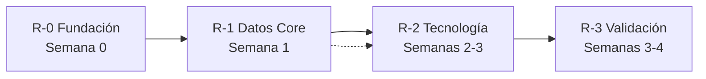

# Research Overview -- Metodología de Investigación BEIQA

## Propósito

Este documento define la metodología de investigación, el orden de dependencias entre temas, y sirve como tracker de progreso para toda la fase de investigación.

---

## Principio Fundamental

> **Primero entender QUÉ construir (Product Questions), luego investigar CÓMO construirlo (Technical Research).**

La [Arquitectura del Sistema](../02-Architecture/System-Architecture.md) es un documento de VISIÓN, no un diseño validado. Cada suposición debe ser verificada con evidencia antes de comprometer recursos.

---

## Dos Capas de Investigación

### Capa 1: Cuestionarios de Producto (Product Questions)

- **Idioma**: Español
- **Formato**: Preguntas puras -- sin respuestas, sin recomendaciones
- **Audiencia**: Pablo y stakeholders
- **Propósito**: Definir completamente QUÉ se quiere construir antes de investigar cómo
- **Ubicación**: `02-Research/Product-Questions/`
- **Cantidad**: 9 documentos, uno por módulo (incluye Interfaz Interna)

### Capa 2: Investigación Técnica (Technical Research)

- **Idioma**: Español (con términos técnicos en inglés donde sea natural)
- **Formato**: Preguntas de investigación + espacio para hallazgos + recomendación
- **Audiencia**: Equipo de desarrollo (futuro), Pablo como decision-maker
- **Propósito**: Responder con evidencia cada decisión técnica
- **Ubicación**: Distribuidos en subcarpetas por tema
- **Cantidad**: 15 nuevos + 6 actualizados = 21 entregables

---

## Fases y Dependencias

### Fase R-0: Fundación (Semana 0)

Crear estructura de navegación y todos los cuestionarios de producto. Pablo y stakeholders responden. Las respuestas informan TODA la investigación técnica posterior.

| Entregable | Estado |
|------------|--------|
| `README.md` (este hub de navegación) | 🔴 |
| `Research-Overview.md` (esta metodología) | 🔴 |
| `Product-Questions/00-Vision-General.md` | 🔴 |
| `Product-Questions/01-Scraper-y-Adquisicion-de-Datos.md` | 🔴 |
| `Product-Questions/02-Ingestion-de-Datos.md` | 🔴 |
| `Product-Questions/03-Base-de-Datos.md` | 🔴 |
| `Product-Questions/04-Inteligencia-de-Mercado.md` | 🔴 |
| `Product-Questions/05-Geoespacial-y-GIS.md` | 🔴 |
| `Product-Questions/06-Cerebro-IA.md` | 🔴 |
| `Product-Questions/07-Portal-Tenants.md` | 🔴 |
| `Product-Questions/08-Interfaz-Interna-y-Experiencia-Equipo.md` | 🔴 |

### Fase R-1: Datos Core (Semana 1)

Cómo los datos entran al sistema, cómo se manejan duplicados, y qué existe en el mercado.

| Entregable | Depende de | Estado |
|------------|------------|--------|
| `Competitive-Landscape.md` | R-0 respondido | 🔴 |
| `Data-Acquisition/Data-Acquisition-Strategy.md` | R-0 respondido | 🔴 |
| `Data-Acquisition/Deduplication-Strategy.md` | Data Acquisition | 🔴 |
| `Scraper-Research/Portal-Comparison.md` (actualizado) | Data Acquisition | 🔴 |

### Fase R-2: Tecnología y Plataforma (Semanas 2-3)

Decisiones de stack + capas de valor. Pueden ejecutarse en paralelo entre sí.

| Entregable | Depende de | Estado |
|------------|------------|--------|
| `Technology-Research/Tech-Stack-Decision.md` | Data Acquisition, Competitive | 🔴 |
| `Technology-Research/Interface-Strategy.md` | R-0 respondido | 🔴 |
| `Technology-Research/Database-Options.md` (actualizado) | Tech Stack | 🔴 |
| `Data-Sources-Research/Google-Maps-Platform.md` (actualizado) | R-0 Geoespacial | 🔴 |
| `Data-Sources-Research/Source-Catalog.md` (actualizado) | R-0 Ingestión | 🔴 |
| `Data-Sources-Research/INEGI-APIs.md` (actualizado) | R-0 Ingestión | 🔴 |
| `Market-Intelligence/Market-Intelligence-Strategy.md` | R-0 Market Intel, Competitive | 🔴 |
| `AI-Strategy/AI-Strategy.md` | R-0 AI, Deduplication | 🔴 |

### Fase R-3: Validación y Factibilidad (Semanas 3-4)

Validar arquitectura contra hallazgos, producir números reales de costos.

| Entregable | Depende de | Estado |
|------------|------------|--------|
| `Architecture-Validation.md` | Todos los de R-1 y R-2 | 🔴 |
| `Cost-Estimates/Total-Budget.md` (actualizado) | Arch Validation, Tech Stack, GIS, AI | 🔴 |
| `Feasibility/MVP-Feasibility.md` | Budget, Arch Validation | 🔴 |

---

## Contexto Clave (del Proceso de Entrevista)

Estos hechos impulsan todas las prioridades de investigación:

- **Timeline**: Urgente -- resultados en 1-2 meses
- **Presupuesto**: $50K-$100K USD
- **Equipo**: No contratado aún -- modelo híbrido (outsource + in-house)
- **Alcance MVP**: UN portal (EasyBroker), UNA ciudad (CDMX), TODOS los tipos de propiedad
- **Cero investigación hecha** -- todos los docs actuales son plantillas sin hallazgos
- **Mayor miedo**: Tomar decisiones tecnológicas equivocadas
- **IA diferida** para procesamiento/matching -- pero deduplicación con IA puede ser necesaria desde el día uno
- **HubSpot se mantiene** como CRM -- BEIQA maneja propiedades/investigación, se sincroniza con HubSpot
- **Construir custom** -- decidido, no documentado por qué
- **Documento de arquitectura es VISIÓN** -- suposiciones no validadas

---

## Cómo Actualizar Este Documento

Conforme avance la investigación:

1. Cambiar 🔴 → 🟡 (en investigación) → 🟢 (hallazgos documentados) → ✅ (decisión tomada)
2. Agregar fecha de inicio y completado por entregable
3. Documentar bloqueos o cambios de alcance
4. Si un hallazgo invalida una suposición, documentarlo explícitamente
