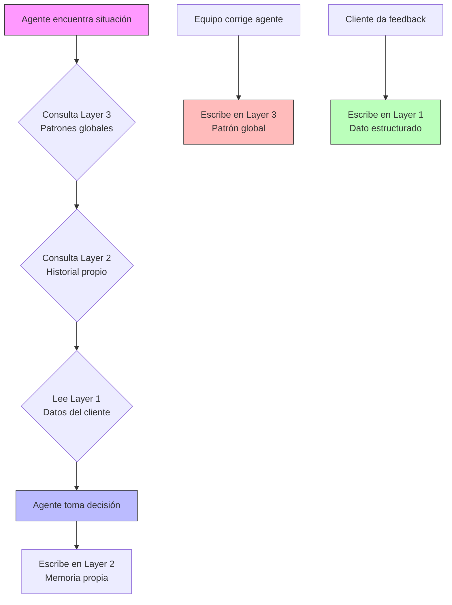

# Arquitectura de Memoria — AI Brain

**Status**: 🟡 En diseño
**Updated**: 2026-03-11

---

## Visión

Los agentes necesitan memoria para aprender de correcciones, mantener contexto de clientes y mejorar con el tiempo. Arquitectura de 3 capas que separa datos estructurados, razonamiento por agente y patrones globales.

---

## 3 Capas

### Layer 1: Shared Client Context (Supabase)

- Datos estructurados en tablas relacionales
- Source of truth para información de clientes
- Todos los agentes LEEN, agentes específicos ESCRIBEN
- RLS enforcement — aislamiento estricto por tenant

| Tabla | Contenido | Escritor | Lector |
|-------|-----------|----------|--------|
| `scoring_documents` | Scoring aprobado (criterios, pesos, zonas) | Score Discovery Agent | Property Search & Match, todos |
| `client_feedback` | Feedback por propiedad (sí/no/quizá + razón) | Tenant Portal (vía API) | Property Search & Match |
| `property_visits` | Visitas agendadas y outcomes | Equipo (manual) | Property Search & Match |
| `shortlists` | Shortlists generados | Property Search & Match | Tenant Portal, equipo |
| `scoring_reports` | Reportes de scoring con resultados | Property Search & Match | Tenant Portal |
| `alert_history` | Alertas proactivas enviadas | Property Search & Match | Equipo, analytics |

### Layer 2: Agent-Specific Memory (Mastra Memory API)

- Memoria persistente por agente, respaldada en Supabase
- Trazas de razonamiento, historial de decisiones, patrones por agente
- Cada agente escribe la suya, lee solo la suya

| Agente | Qué recuerda |
|--------|-------------|
| Address Enrichment | Patrones por colonia, correcciones exitosas, señales más confiables por zona |
| Data Normalization | Mappings especiales por portal, features que el LLM extrae correctamente vs no |
| Deduplication | Pares confirmados/rechazados por el equipo, thresholds ajustados |
| Score Discovery | Estilos de expresión del cliente, criterios que siempre olvidan mencionar |
| Property Search & Match | POR CLIENTE: likes/dislikes, visitas, preferencias implícitas, historial de búsqueda |

### Layer 3: System Memory (Mastra Shared Memory)

- Aprendizaje global al que TODOS los agentes contribuyen y del que todos leen
- Patrones de corrección, reglas de negocio aprendidas con el tiempo
- Previene que se repitan los mismos errores

| Tipo | Ejemplo |
|------|---------|
| Correcciones recurrentes | "Direcciones de colonia X en portal Y siempre apuntan al centroide" |
| Data quality patterns | "Precios de Pincali siempre vienen en MXN, nunca USD" |
| Reglas de negocio | "Cliente tipo logística siempre necesita andenes aunque no lo mencione" |
| Comportamiento de agentes | "Score threshold de 0.72 genera muchos falsos positivos en dedup zona Z" |

---

## Diagrama de Flujo

**Flujo resumido**:
1. Agente encuentra situación -> consulta Layer 3 (patrones globales) -> consulta Layer 2 (historial propio) -> lee Layer 1 (datos del cliente)
2. Agente toma decisión -> escribe en Layer 2 (memoria propia)
3. Equipo corrige agente -> escribe en Layer 3 (patrón global)
4. Cliente da feedback -> escribe en Layer 1 (dato estructurado)

---

## Implementación Técnica

### Mastra Memory API

- Mastra ofrece persistent memory respaldada en Supabase
- Shared memory (cross-agent) para Layer 3
- RAG para búsqueda semántica sobre memoria
- Thread-based memory para conversaciones del modo interactivo

### Tablas Supabase adicionales (para Layer 1)

| Tabla | Columnas clave | Descripción |
|-------|---------------|-------------|
| `scoring_documents` | `id`, `client_id`, `criteria JSONB`, `weights JSONB`, `zones TEXT[]`, `status`, `created_at`, `updated_at` | Documento de scoring aprobado por cliente |
| `client_feedback` | `id`, `client_id`, `property_id`, `rating ENUM(yes/no/maybe)`, `reason TEXT`, `created_at` | Feedback del tenant sobre propiedades presentadas |
| `property_visits` | `id`, `client_id`, `property_id`, `scheduled_at`, `outcome ENUM(interested/rejected/pending)`, `notes TEXT` | Registro de visitas y sus resultados |
| `shortlists` | `id`, `client_id`, `property_ids UUID[]`, `score_config JSONB`, `generated_at`, `status` | Shortlists generados por el agente de búsqueda |
| `scoring_reports` | `id`, `client_id`, `shortlist_id`, `results JSONB`, `generated_at` | Reportes de scoring con resultados detallados |
| `alert_history` | `id`, `client_id`, `property_id`, `alert_type`, `channel`, `sent_at`, `opened BOOLEAN` | Historial de alertas proactivas enviadas |

---

## Consideraciones

- **Layer 1 es CRITICAL para MVP** — debe estar implementada para Sprint 1
- **Layer 2 es IMPORTANT** — necesaria para Sprint 2 (Score Discovery)
- **Layer 3 es SHOULD** — puede empezar con patrones simples e ir creciendo
- La memoria debe ser podable (no crecer indefinidamente)
- RLS debe aplicarse en TODAS las capas para aislamiento de datos de clientes
