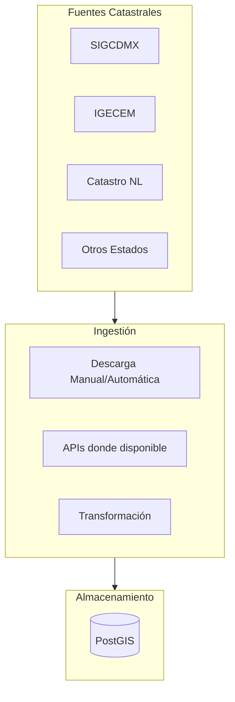

# Investigación: Datos Catastrales

## Objetivo

Investigar disponibilidad y acceso a datos catastrales de México para integrar en la plataforma.

**Estado**: 🔴 Por investigar

---

## ¿Qué son los Datos Catastrales?

Los datos catastrales contienen información sobre:
- Predios (terrenos y construcciones)
- Valores catastrales
- Usos de suelo autorizados
- Propietarios (no siempre públicos)
- Geometrías de predios

---

## Estructura Catastral en México

### Nivel Federal
- No existe un catastro nacional unificado
- SEDATU coordina pero no centraliza

### Nivel Estatal
- Cada estado tiene su propio sistema catastral
- Diferentes niveles de digitalización
- Diferentes políticas de acceso

### Nivel Municipal
- Muchos municipios mantienen sus propios catastros
- Gran variabilidad en calidad y acceso

---

## Estados Prioritarios a Investigar

### 1. Ciudad de México (CDMX)

| Aspecto | Información | Por Verificar |
|---------|-------------|---------------|
| Entidad responsable | Secretaría de Administración y Finanzas | |
| Portal de datos | SIGCDMX | 🔴 Verificar acceso |
| Datos disponibles | Predios, valores, usos de suelo | 🔴 |
| Formato | Shapefiles, WFS/WMS | 🔴 |
| API disponible | Posiblemente WFS | 🔴 |
| Costo | Generalmente gratuito | 🔴 |

**Acciones**:
- [ ] Explorar portal SIGCDMX
- [ ] Verificar si hay API o descarga disponible
- [ ] Evaluar cobertura y actualización

### 2. Estado de México

| Aspecto | Información | Por Verificar |
|---------|-------------|---------------|
| Entidad responsable | IGECEM | |
| Portal de datos | Portal GeoMéxico | 🔴 |
| Datos disponibles | ??? | 🔴 |
| Formato | ??? | 🔴 |

### 3. Nuevo León

| Aspecto | Información | Por Verificar |
|---------|-------------|---------------|
| Entidad responsable | Instituto de Catastro | |
| Portal de datos | ??? | 🔴 |
| Datos disponibles | ??? | 🔴 |

### 4. Jalisco

| Aspecto | Información | Por Verificar |
|---------|-------------|---------------|
| Entidad responsable | Instituto de Información Territorial | |
| Portal de datos | IITEJ | 🔴 |
| Datos disponibles | ??? | 🔴 |

### 5. Otros Estados Relevantes

- Querétaro
- Guanajuato
- Aguascalientes
- Baja California
- Coahuila
- Chihuahua

---

## Tipos de Datos Catastrales de Interés

### Alta Prioridad

| Dato | Uso en BEIQA |
|------|--------------|
| Polígonos de predios | Identificar exactamente qué predio |
| Usos de suelo | Validar que se puede usar para industria/comercio |
| Superficie de terreno | Validar datos de listings |
| Valores catastrales | Referencia de valor (no siempre refleja mercado) |

### Media Prioridad

| Dato | Uso en BEIQA |
|------|--------------|
| Zonificación | Restricciones de construcción |
| Densidad permitida | Para análisis de potencial |
| Infraestructura | Servicios disponibles |

### Baja Prioridad

| Dato | Uso en BEIQA |
|------|--------------|
| Historia de propietarios | Generalmente no disponible |
| Valores comerciales | Mejor usar datos de mercado |

---

## Alternativas si No Hay Acceso Directo

### 1. Solicitudes de Información (INAI)

- Se puede solicitar información pública
- Proceso lento (20+ días hábiles)
- Puede no ser viable para datos masivos

### 2. Proveedores Comerciales

| Proveedor | Descripción | Por Investigar |
|-----------|-------------|----------------|
| SoftPro | Software de valuación con datos | 🔴 |
| CIEN | Soluciones de información | 🔴 |
| InfoCatastro | Servicios de información catastral | 🔴 |

### 3. Notarios y Valuadores

- Pueden tener acceso a datos catastrales
- Modelo de partnership o contratación

---

## Consideraciones Técnicas

### Integración de Datos

### Normalización Necesaria

- Diferentes sistemas de coordenadas por estado
- Diferentes estructuras de datos
- Diferentes identificadores de predio
- Diferentes frecuencias de actualización

---

## Plan de Investigación

### Semana 1-2

1. [ ] Explorar portales de CDMX, EdoMex, NL
2. [ ] Documentar qué datos están disponibles
3. [ ] Verificar formatos y acceso

### Semana 3-4

4. [ ] Descargar datos de muestra donde sea posible
5. [ ] Probar carga en PostGIS
6. [ ] Evaluar calidad y cobertura

### Semana 5+

7. [ ] Definir estrategia de integración por estado
8. [ ] Estimar esfuerzo de normalización
9. [ ] Priorizar estados para MVP

---

## Hallazgos

*(Documentar aquí los resultados de la investigación)*

### CDMX - SIGCDMX
- URL: 
- Datos encontrados:
- Acceso:
- Notas:

### Estado de México
- URL:
- Datos encontrados:
- Acceso:
- Notas:

---

## Preguntas Abiertas

1. ¿Qué estados son prioritarios para el negocio de Beiqa?
2. ¿Cuánta precisión necesitamos en polígonos de predios?
3. ¿Presupuesto disponible para proveedores comerciales?
4. ¿Qué tan crítico es tener datos catastrales para MVP vs fases posteriores?
