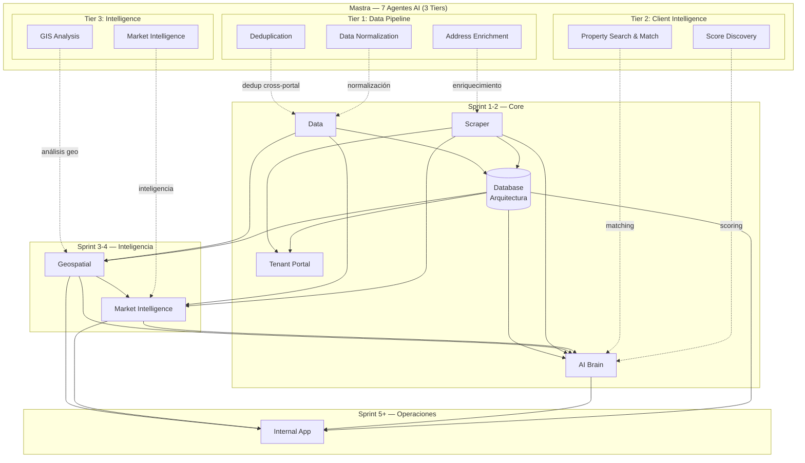

# Módulos de la Plataforma BEIQA

> Hub central de todos los módulos funcionales. Cada módulo es auto-contenido con su descripción, preguntas de producto, requerimientos e investigación técnica.

---

## Mapa de Módulos

| Módulo | Descripción | Sprint | Estado |
|--------|-------------|--------|--------|
| [Scraper](./Scraper/) | Extracción automatizada de propiedades (Trigger.dev + Firecrawl). CBRE/Colliers/FINSA/Pincali en producción. I24 migrando de Apify | Sprint 1+ | 🟢 En desarrollo |
| [Data](./Data/) | Normalización (Mastra agents), integración de fuentes externas | Sprint 1-2 | 🟢 En desarrollo |
| [AI Brain](./AI-Brain/) | Agentes AI con Mastra (enrichment, normalization, matching) | Sprint 1+ | 🟢 En desarrollo |
| [Geospatial](./Geospatial/) | Análisis geoespacial, H3, AGEB, mapas | Sprint 3+ | 🟡 En pruebas |
| [Tenant Portal](./Tenant-Portal/) | Portal web para clientes: scoring, shortlists, feedback | Sprint 1+ | 🟡 En desarrollo |
| [Internal App](./Internal-App/) | Aplicación web para el equipo Beiqa (Next.js — Pamela) | Sprint 5+ | 🟡 En diseño |
| [Market Intelligence](./Market-Intelligence/) | Análisis de mercado, tendencias, reportes automatizados | Sprint 4+ | 🔴 Por iniciar |

> **Nota**: La Base de Datos (PostgreSQL + PostGIS) vive en [02-Architecture/Database/](../02-Architecture/Database/) como infraestructura compartida.

> **Mastra como capa transversal**: [Mastra](../02-Architecture/Agent-Architecture.md) es el framework de orquestación de agentes AI que opera como capa transversal a todos los módulos. Los agentes de Mastra (Data Normalization Agent, Address Enrichment Agent, GIS Analysis Agent, etc.) proporcionan capacidades de enriquecimiento, normalización e inteligencia que cruzan las fronteras de los módulos individuales.

---

## Mapeo a Milestones y Sprints

> Detalle completo en [03-Roadmap/Roadmap.md](../03-Roadmap/Roadmap.md). 13 milestones, 8 sprints (Q1-Q2 2026).

### Q1 (Sprint 1-2) — Fundaciones

| Módulo | Milestones | Alcance |
|--------|-----------|---------|
| **Scraper** | Scrapers Consolidados | CBRE/Colliers/FINSA/Pincali ✅. I24 migración a Trigger.dev |
| **Data** | Golden Record Pipeline (inicio) | Golden record schema, normalización vía Mastra agents |
| **AI Brain** | Enrichment Agent Operativo (inicio) | Address Enrichment Agent, LLM eval |
| **Tenant Portal** | Portal Autenticado (inicio) | Supabase Auth (magic link), scoring desde DB |

### Q2 Sprint 3-4 — Inteligencia + Pipeline

| Módulo | Milestones | Alcance |
|--------|-----------|---------|
| **AI Brain** | Enrichment Agent (cierre), Golden Record Pipeline (cierre) | Backfill, normalization E2E, AGEB import |
| **Tenant Portal** | Design System, Scoring Automatizado | Componentes shadcn/ui, scoring pages desde Supabase |

### Q2 Sprint 5-6 — Portal + Geoespacial

| Módulo | Milestones | Alcance |
|--------|-----------|---------|
| **AI Brain** | Scoring Automatizado, Búsqueda Inteligente | Property Search & Match Agent, Dedup Agent >95% |
| **Geospatial** | Inteligencia Geoespacial | H3 post-enrichment, GIS Agent, zone quality |
| **Tenant Portal** | Portal con Shortlists | Shortlists UI, feedback, mapa, Vercel deploy |

### Q2 Sprint 7-8 — Producción + Operaciones

| Módulo | Milestones | Alcance |
|--------|-----------|---------|
| **Market Intelligence** | Inteligencia de Mercado | Market Intel Agent, precio/m², comparables |
| **Tenant Portal** | Portal en Producción | Tenant onboarding, ≥1 tenant activo |
| **Internal App** | Dashboard Interno | Internal App lee golden record |
| **Infra** | Operación Estable | CI/CD, evals, monitoring, docs |

---

## Diagrama de Dependencias



---

## Estructura Estándar de Cada Módulo

Cada módulo contiene:

```
Módulo/
├── README.md              # Overview: descripción, objetivos, métricas, entregables, dependencias, riesgos
├── Product-Questions.md   # Cuestionario de discovery (preguntas de producto)
├── Requirements.md        # Capacidades con priorización Must/Should/Could
└── Research/              # Investigación técnica (docs específicos del módulo)
```

---

## Cómo Navegar

1. **Elige un módulo** de la tabla de arriba
2. **Lee el README.md** para entender qué hace, sus objetivos y métricas
3. **Responde el Product-Questions.md** para informar el diseño
4. **Consulta Requirements.md** para ver las capacidades definidas
5. **Explora Research/** para la investigación técnica de soporte

---

*Última actualización: 2026-03-09*
