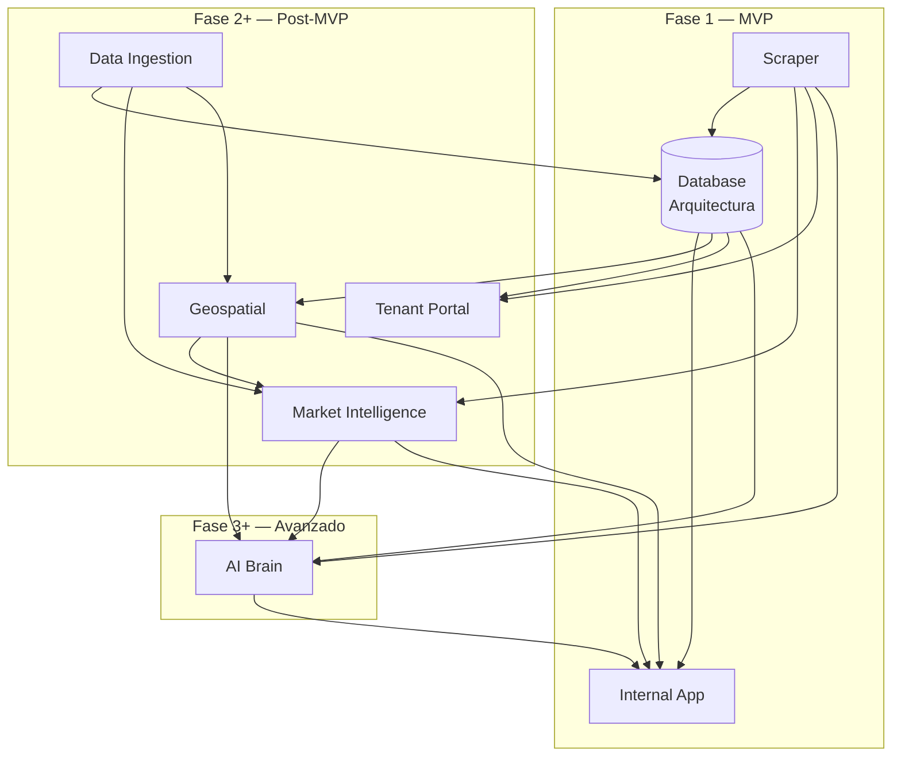

# Módulos de la Plataforma BEIQA

> Hub central de todos los módulos funcionales. Cada módulo es auto-contenido con su descripción, preguntas de producto, requerimientos e investigación técnica.

---

## Mapa de Módulos

| Módulo | Descripción | Fase | Estado |
|--------|-------------|------|--------|
| [Scraper](./Scraper/) | Extracción automatizada de propiedades (Apify + n8n) | Fase 1 | 🟢 En desarrollo |
| [Internal App](./Internal-App/) | Aplicación web para el equipo Beiqa (Next.js — Pamela) | Fase 1 | 🟡 Diseño activo |
| [Data Ingestion](./Data-Ingestion/) | Integración de fuentes externas (INEGI, Google, catastro) | Fase 2 | 🔴 Por iniciar |
| [Market Intelligence](./Market-Intelligence/) | Análisis de mercado, tendencias, reportes automatizados | Fase 2 | 🔴 Por iniciar |
| [Geospatial](./Geospatial/) | Análisis geoespacial, H3, AGEB, mapas | Fase 2 | 🔴 Por iniciar |
| [Tenant Portal](./Tenant-Portal/) | Portal web para clientes: scoring, shortlists, feedback | Fase 2 | 🟡 En diseño |
| [AI Brain](./AI-Brain/) | Matching inteligente, NLP, procesamiento de llamadas | Fase 3 | 🔴 Por iniciar |

> **Nota**: La Base de Datos (PostgreSQL + PostGIS) vive en [02-Architecture/Database/](../02-Architecture/Database/) como infraestructura compartida.

---

## Mapeo a Fases del Proyecto

### Fase 1 — Scrapers & Inventario (En curso)

| Módulo | Alcance |
|--------|---------|
| **Scraper** | Apify actor Inmuebles24 ✅, normalización n8n, deduplicación, EasyBroker |
| **Internal App** | Next.js — lista propiedades, mapa, filtros, shortlists (Pamela) |
| **Database** *(Arquitectura)* | Supabase activo ✅, 14 migrations ✅, ~60K propiedades ✅ |

### Fase 2 — Portal Web + Data Ingestion

| Módulo | Alcance |
|--------|---------|
| **Tenant Portal** | Portal para clientes: shortlists, feedback, mapa de opciones |
| **Data Ingestion** | INEGI DENUE, Google Places, AGEB shapefiles, H3 index |
| **Market Intelligence** | Tendencias de precio, precio promedio m2, heatmaps por zona |
| **Geospatial** | H3 + AGEB + cache de APIs externas |

### Fase 3 — AI Brain

| Módulo | Alcance |
|--------|---------|
| **AI Brain** | Procesamiento de llamadas (CircleBack), property matching, NLP en búsquedas |

---

## Diagrama de Dependencias



---

## Estructura Estándar de Cada Módulo

Cada módulo contiene:

```
Módulo/
├── README.md              # Overview: descripción, objetivos, métricas, entregables, dependencias, riesgos
├── Product-Questions.md   # Cuestionario de discovery (preguntas de producto)
├── Requirements.md        # Capacidades con priorización Must/Should/Could
└── Research/              # Investigación técnica (docs específicos del módulo)
```

---

## Cómo Navegar

1. **Elige un módulo** de la tabla de arriba
2. **Lee el README.md** para entender qué hace, sus objetivos y métricas
3. **Responde el Product-Questions.md** para informar el diseño
4. **Consulta Requirements.md** para ver las capacidades definidas
5. **Explora Research/** para la investigación técnica de soporte

---

*Última actualización: 2026-03-02*
