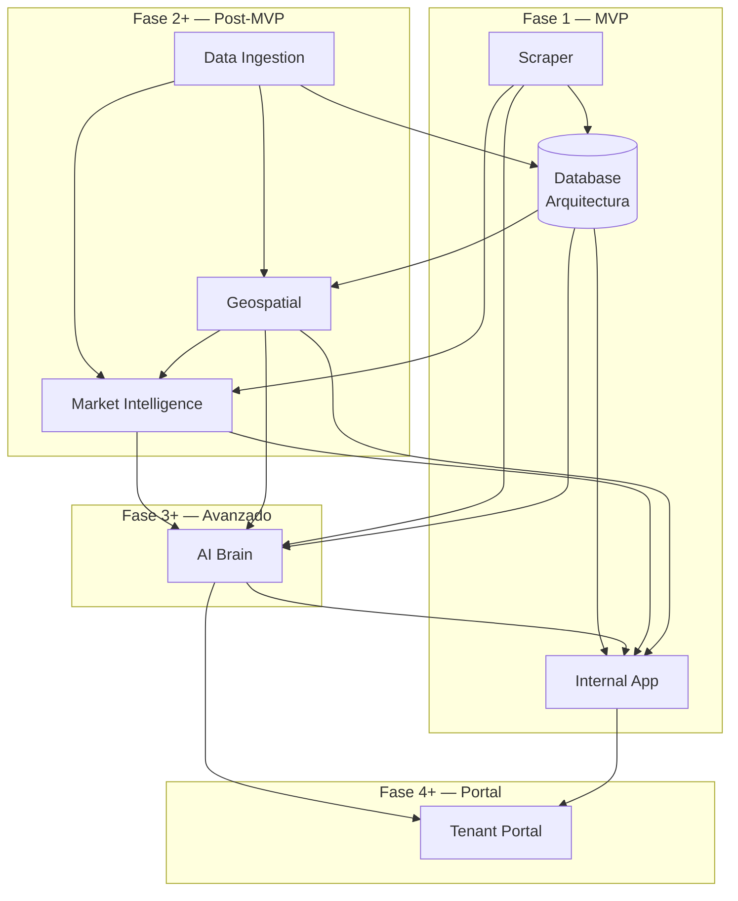

# Módulos de la Plataforma BEIQA

> Hub central de todos los módulos funcionales. Cada módulo es auto-contenido con su descripción, preguntas de producto, requerimientos e investigación técnica.

---

## Mapa de Módulos

| Módulo | Descripción | Fase | Estado |
|--------|-------------|------|--------|
| [Scraper](./Scraper/) | Extracción automatizada de propiedades de portales | Fase 1 — MVP | 🟡 En diseño |
| [Internal App](./Internal-App/) | Aplicación web para el equipo Beiqa | Fase 1 — MVP | 🟡 En diseño |
| [Data Ingestion](./Data-Ingestion/) | Integración de fuentes externas (INEGI, APIs, catastro) | Fase 2 | 🔴 Por iniciar |
| [Market Intelligence](./Market-Intelligence/) | Análisis de mercado, tendencias, reportes automatizados | Fase 2+ | 🔴 Por iniciar |
| [Geospatial](./Geospatial/) | Análisis geoespacial, mapas, búsqueda por zona | Fase 2+ | 🔴 Por iniciar |
| [AI Brain](./AI-Brain/) | Matching inteligente propiedad-cliente, NLP, recomendaciones | Fase 3+ | 🔴 Por iniciar |
| [Tenant Portal](./Tenant-Portal/) | Portal web para clientes corporativos | Fase 4+ | 🔴 Por iniciar |

> **Nota**: La Base de Datos (PostgreSQL + PostGIS) vive en [02-Architecture/Database/](../02-Architecture/Database/) como infraestructura compartida.

---

## Mapeo a Fases del Proyecto

### Fase 1 — MVP (6-8 semanas)

| Módulo | Alcance MVP |
|--------|-------------|
| **Scraper** | 2-3 portales principales (EasyBroker, Inmuebles24), normalización, scheduler |
| **Internal App** | CRUD de propiedades, búsqueda con filtros, mapa básico, gestión de clientes, shortlists |
| **Database** *(Arquitectura)* | Modelo de datos core, PostgreSQL + PostGIS, API CRUD |

### Fase 2+ — Post-MVP

| Módulo | Alcance |
|--------|---------|
| **Data Ingestion** | Conectores INEGI, Google Maps, catastro, proveedores comerciales |
| **Market Intelligence** | Tendencias de precio, vacancy rates, reportes automatizados |
| **Geospatial** | Análisis avanzado por zona, POIs, visualización de capas |

### Fase 3+ — Avanzado

| Módulo | Alcance |
|--------|---------|
| **AI Brain** | Matching propiedad-cliente, NLP, deduplicación con IA, recomendaciones |

### Fase 4+ — Portal de Clientes

| Módulo | Alcance |
|--------|---------|
| **Tenant Portal** | Vista de propiedades, comparador, feedback, comunicación |

---

## Diagrama de Dependencias



---

## Estructura Estándar de Cada Módulo

Cada módulo contiene:

```
Módulo/
├── README.md              # Overview: descripción, objetivos, métricas, entregables, dependencias, riesgos
├── Product-Questions.md   # Cuestionario de discovery (preguntas de producto)
├── Requirements.md        # Capacidades con priorización Must/Should/Could
└── Research/              # Investigación técnica (docs específicos del módulo)
```

---

## Cómo Navegar

1. **Elige un módulo** de la tabla de arriba
2. **Lee el README.md** para entender qué hace, sus objetivos y métricas
3. **Responde el Product-Questions.md** para informar el diseño
4. **Consulta Requirements.md** para ver las capacidades definidas
5. **Explora Research/** para la investigación técnica de soporte

---

*Última actualización: 2026-02-24*
