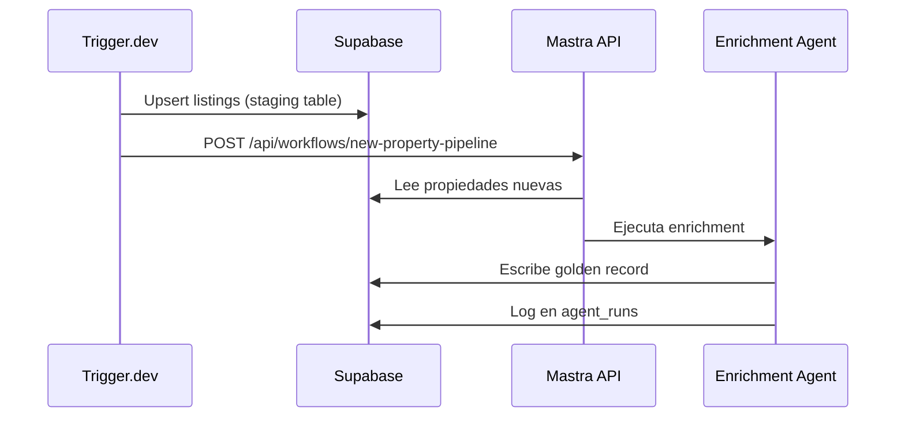
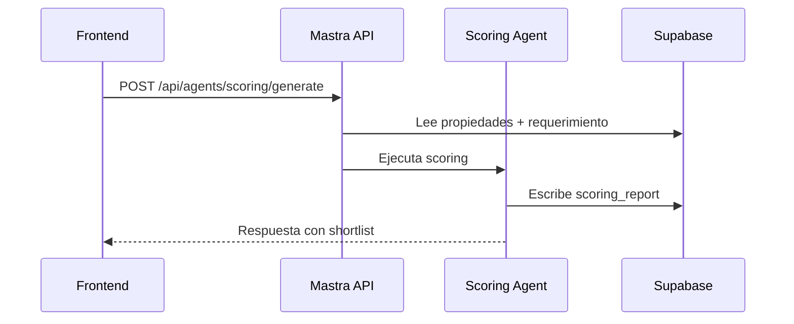
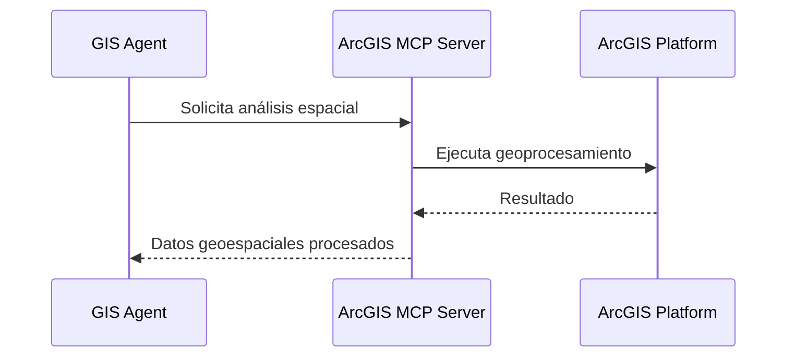

# Arquitectura de Agentes AI — BEIQA Platform

> **Estado**: 🟢 En implementación | **Actualizado**: 2026-03-09
>
> Framework: [Mastra](https://mastra.ai) (ADR-020) | Repo: `beiqa-agents`
> Separación de responsabilidades: [ADR-021](ADRs/ADR-021-Separacion-Trigger-Mastra.md)

---

## Visión

El AI Brain es la **capa transversal de inteligencia** de la plataforma Beiqa. No es un módulo aislado — provee y consume inteligencia de todos los demás módulos. Implementado con Mastra, orquesta agentes especializados que enriquecen datos, normalizan información, detectan duplicados, generan scoring, producen inteligencia de mercado, y ejecutan análisis geoespacial.

```
┌──────────────────────────────────────────────────────────────────────┐
│                       AI BRAIN (Mastra)                              │
│                 Capa transversal de inteligencia                     │
│                                                                      │
│   ┌───────────────┐  ┌──────────────┐  ┌─────────────────────────┐  │
│   │   Address      │  │    Data       │  │    Deduplication        │  │
│   │   Enrichment   │  │  Normalization│  │    Agent                │  │
│   │   Agent        │  │    Agent      │  │                         │  │
│   └───────┬───────┘  └──────┬───────┘  └────────────┬────────────┘  │
│           │                 │                        │               │
│   ┌───────┴───────┐  ┌─────┴────────┐  ┌───────────┴───────────┐   │
│   │   Scoring /    │  │   Market      │  │    GIS Analysis       │   │
│   │   Matching     │  │  Intelligence │  │    Agent              │   │
│   │   Agent        │  │    Agent      │  │                       │   │
│   └───────────────┘  └──────────────┘  └───────────────────────┘   │
│                                                                      │
│   Tools: Google Geocoding, ArcGIS MCP, H3, PostGIS, LLMs (TBD)     │
│   Memory: Persistent (Supabase-backed) | Workflows: Multi-step     │
└──────────────────────────────────────────────────────────────────────┘
         │              │              │              │
    ┌────▼────┐   ┌────▼────┐   ┌────▼────┐   ┌────▼─────────────┐
    │ Scraper │   │  Data   │   │Geospatial│   │Market Intelligence│
    │ Module  │   │ Module  │   │ Module   │   │     Module        │
    └─────────┘   └─────────┘   └──────────┘   └──────────────────┘
```

---

## Agentes

### Tabla resumen

| Agente | Módulo(s) que sirve | Prioridad | Tools | Modelo LLM | Estado |
|--------|-------------------|-----------|-------|------------|--------|
| Address Enrichment | Data, Geospatial | **P0** (bloqueador) | Google Geocoding, Reverse Geocoding, Description Parser, Coordinate Validator | TBD | 🔴 Por implementar |
| Data Normalization | Data | **P0** | Currency Converter, Unit Converter, Feature Extractor, Property Type Mapper | TBD | 🔴 Por implementar |
| Deduplication | Data | **P1** | H3 Blocker, Scoring Calculator, PostGIS Distance | TBD | 🔴 Por implementar |
| Scoring / Matching | Internal App, Tenant Portal | **P1** (migra de frontend) | Requirement Parser, Property Ranker, Shortlist Generator | TBD | 🔴 Por implementar |
| Market Intelligence | Market Intelligence | **P2** | Price Trend Calculator, Supply Analysis, Zone Stats, Comparables Finder | TBD | 🔴 Por implementar |
| GIS Analysis | Geospatial | **P2** | H3 Indexer, AGEB Lookup, Proximity Calculator, ArcGIS MCP | TBD | 🔴 Por implementar |

> **Nota sobre modelos LLM**: Todos marcados como TBD. La selección de modelo requiere evaluación empírica por agente/tarea, midiendo: costo, calidad (especialmente en español), velocidad de respuesta, y capacidad de structured output. Mastra permite asignar diferentes modelos por agente.

> **Nota sobre evolución**: Los agentes pueden fusionarse o dividirse según lo dicte la experiencia. La arquitectura debe ser flexible para permitir iteración.

---

### Address Enrichment Agent (P0)

**Problema que resuelve**: 50%+ de las direcciones de portales de alto volumen (Inmuebles24, Pincali) son incorrectas o incompletas. Coordenadas frecuentemente apuntan al centroide de la colonia en lugar de la ubicación real.

**Módulos que sirve**: Data (corrección de datos), Geospatial (coordenadas correctas para H3/AGEB)

**Proceso (multi-señal)**:
1. **Validar coordenadas** — ¿Están dentro de la zona geográfica esperada (CDMX, EdoMex, Morelos, Puebla)?
2. **Geocodificar dirección** — Google Geocoding API: dirección texto → coordenadas
3. **Reverse geocoding** — Google: coordenadas originales → dirección de verificación
4. **Analizar descripción** — LLM: extraer pistas de dirección/ubicación del texto libre de la descripción
5. **Calcular confidence score** — Comparar señales, asignar 0-100
6. **Persistir** — Escribir dirección corregida + confidence a Supabase

**Tools**:
| Tool | Input | Output | API/Servicio |
|------|-------|--------|-------------|
| `google-geocode` | dirección texto | coordenadas + formatted_address | Google Geocoding API |
| `google-reverse-geocode` | lat/lng | dirección + componentes | Google Geocoding API |
| `coordinate-validator` | lat/lng + zona esperada | boolean + distancia al centroide | PostGIS (ST_Contains) |
| `description-address-extractor` | texto descripción | dirección extraída + landmarks | LLM (TBD) |
| `confidence-scorer` | señales múltiples | score 0-100 + breakdown | Determinístico |

**Output**: `{ corrected_address, corrected_lat, corrected_lng, confidence_score, h3_indices, signals_used }`

**Métricas de evaluación**:
- Accuracy: % de direcciones corregidas vs verificación manual (target: >80%)
- Cobertura: % de propiedades procesadas (target: 100%)
- Costo por propiedad: $ promedio de APIs + LLM por enriquecimiento

---

### Data Normalization Agent (P0)

**Problema que resuelve**: Las staging tables de cada portal tienen schemas, formatos, y convenciones diferentes. Los datos deben normalizarse a un golden record unificado (`properties`).

**Módulos que sirve**: Data

**Proceso**:
1. **Leer** propiedad de staging table (inmuebles24_listings, pincali_listings, etc.)
2. **Mapear campos** — Cada portal tiene mapeo diferente al golden record
3. **Normalizar valores** — Moneda (MXN/USD), unidades (m²/ft²), tipos de propiedad
4. **Extraer features** — LLM analiza descripción para extraer amenidades, condiciones, etc.
5. **Validar** — Rangos razonables (precio, superficie, coordenadas)
6. **Escribir** — Upsert al golden record `properties` + link en `property_sources`

**Tools**:
| Tool | Función |
|------|---------|
| `currency-converter` | MXN ↔ USD con tasa actualizada |
| `unit-converter` | m² ↔ ft², hectáreas, etc. |
| `property-type-mapper` | Mapeo de tipos por portal al catálogo Beiqa |
| `feature-extractor` | LLM extrae features de descripción (amenidades, condiciones, etc.) |
| `price-validator` | Valida que precio esté en rango razonable para tipo/zona |

---

### Deduplication Agent (P1)

**Problema que resuelve**: La misma propiedad aparece en múltiples portales con datos ligeramente diferentes. Tabla `possible_duplicates` ya existe pero necesita un pipeline robusto.

**Módulos que sirve**: Data

**Algoritmo (híbrido)**:
1. **Blocking** — Agrupar candidatos por proximidad geográfica (H3 res 9 o PostGIS radius)
2. **Scoring determinístico** — 6 señales: dirección fuzzy match, distancia coordenadas, superficie ±10%, tipo propiedad, precio ±15%, broker
3. **Clasificación**: score >0.95 → auto-merge, score <0.70 → no match, score 0.70-0.95 → LLM resolution
4. **LLM resolution** — Solo para casos ambiguos: el LLM compara descripciones y datos para decidir
5. **Merge** — Combinar mejor información de cada fuente en el golden record

**Tools**:
| Tool | Función |
|------|---------|
| `h3-blocker` | Agrupa propiedades en mismo hexágono H3 res 9 |
| `postgis-distance` | Calcula distancia entre coordenadas |
| `fuzzy-address-matcher` | Similitud de direcciones (Levenshtein, tokenizado) |
| `dedup-scorer` | Calcula score multi-señal (determinístico) |
| `llm-dedup-resolver` | LLM decide para casos ambiguos (0.70-0.95) |

**Métricas**: Precisión >85% (verificación manual de 50 pares), <2% falsos positivos

---

### Scoring / Matching Agent (P1)

**Problema que resuelve**: Cruzar requerimientos de clientes con propiedades disponibles para generar shortlists rankeadas por relevancia. Hoy vive en `beiqa-frontend` — migra a Mastra.

**Módulos que sirve**: Internal App, Tenant Portal

**Proceso**:
1. **Parsear requerimiento** — Estructura del brief del cliente (superficie, presupuesto, zona, tipo, etc.)
2. **Filtrar candidatas** — Query a Supabase con filtros duros
3. **Rankear** — LLM evalúa fit de cada propiedad vs requerimiento, considerando factores cualitativos
4. **Generar shortlist** — Top N propiedades con score + justificación
5. **Persistir** — Escribir a `scoring_reports` + `scoring_results`

**Tools**:
| Tool | Función |
|------|---------|
| `requirement-parser` | Estructura requerimiento de cliente en formato estándar |
| `property-filter` | Query a Supabase con filtros del requerimiento |
| `property-ranker` | LLM evalúa fit propiedad-requerimiento |
| `shortlist-generator` | Genera reporte con top N + justificación |

**Migración desde frontend**: El código actual en `beiqa-frontend/src/app/api/scorings/generate/` se refactoriza como agente Mastra. El frontend pasa a llamar la API de Mastra en lugar de ejecutar la lógica internamente.

---

### Market Intelligence Agent (P2)

**Problema que resuelve**: Generar inteligencia de mercado automatizada — tendencias de precio, análisis de oferta/demanda, comparables por zona.

**Módulos que sirve**: Market Intelligence

**Capacidades**:
- Precio/m² promedio por zona (H3 res 7 o AGEB)
- Tendencias de precio (histórico de listings)
- Inventario disponible por zona y tipo
- Comparables para una propiedad específica
- Narrativa de mercado generada por LLM

**Tools**:
| Tool | Función |
|------|---------|
| `price-trend-calculator` | Calcula tendencias de precio por zona/tipo |
| `supply-analyzer` | Inventario y tasa de absorción por zona |
| `comparables-finder` | Propiedades similares en zona cercana |
| `zone-stats` | Estadísticas agregadas por H3/AGEB |
| `narrative-generator` | LLM genera resumen ejecutivo de mercado |

---

### GIS Analysis Agent (P2)

**Problema que resuelve**: Cálculo de índices geoespaciales (H3, AGEB), análisis de proximidad, y calidad de zona. Conecta con ArcGIS vía MCP.

**Módulos que sirve**: Geospatial

**Capacidades**:
- Cálculo de H3 a múltiples resoluciones (5, 7, 9, 11)
- Asignación de AGEB via spatial join (PostGIS)
- Análisis de proximidad (distancia a puntos de interés)
- Score de calidad de zona
- Integración con ArcGIS vía MCP para análisis avanzado

**Tools**:
| Tool | Función |
|------|---------|
| `h3-indexer` | Calcula índices H3 res 5/7/9/11 para coordenadas (h3-js) |
| `ageb-lookup` | Spatial join propiedad → AGEB (PostGIS ST_Contains) |
| `proximity-calculator` | Distancia a puntos de interés (transporte, comercios) |
| `zone-quality-scorer` | Score compuesto de calidad de zona |
| `arcgis-mcp` | Operaciones geoespaciales avanzadas vía MCP server |

---

## Patrones de Comunicación

### Trigger.dev → Mastra (post-scrape)



### Frontend → Mastra (scoring on-demand)



### Mastra → ArcGIS (GIS vía MCP)



---

## Estrategia de MCP

Mastra actúa como **MCP client** que consume servicios externos, y puede exponer sus propias capacidades como **MCP server**.

| MCP Server | Proveedor | Qué consume |
|-----------|-----------|-------------|
| ArcGIS Location Services | ArcGIS / comunidad | Geoprocesamiento avanzado, análisis espacial |
| GIS-MCP | Comunidad (GitHub) | Operaciones geométricas, transformaciones, mapas estáticos |
| Supabase MCP | Supabase | Queries directas a la DB (alternativa a client) |

| MCP Server expuesto por Mastra | Qué ofrece |
|-------------------------------|-----------|
| Scoring API | Generación de shortlists (consumido por Claude Desktop / Rube) |
| Market Intelligence | Reportes de mercado (consumido por Claude Desktop / Rube) |

---

## Estrategia de Modelos LLM

**Estado: TBD — requiere evaluación empírica.**

Cada agente y cada tool que use LLM debe evaluarse con al menos 2-3 modelos antes de elegir. Mastra permite asignar diferentes modelos por agente.

### Métricas de evaluación por modelo

| Métrica | Cómo se mide | Importancia |
|---------|-------------|-------------|
| Calidad en español | Accuracy de extracción en texto mexicano inmobiliario | Alta |
| Structured output | % de respuestas que parsean correctamente al schema esperado | Alta |
| Costo por llamada | $ promedio por request | Media |
| Latencia | ms promedio de respuesta | Baja (batch) / Alta (on-demand) |
| Consistencia | Varianza en respuestas para el mismo input | Media |

### Candidatos a evaluar

- Claude (Haiku, Sonnet, Opus) — vía API directa
- GPT-4o, GPT-4o-mini — vía OpenAI API o OpenRouter
- Modelos open-source (Llama, Mistral) — vía OpenRouter o self-hosted

La selección final se documenta por agente conforme se implemente y evalúe.

---

## Schema de Supabase (cambios necesarios)

### Tablas nuevas

| Tabla | Propósito | Columnas clave |
|-------|----------|---------------|
| `properties` | Golden record (deduplicado, normalizado) | id, normalized_address, corrected_lat/lng, confidence_score, property_type, operation_type, price, surface_m2, h3_res5/7/9/11, ageb_id, ... |
| `property_sources` | Links staging → golden record | property_id, source_table, source_id, source_portal |
| `agent_runs` | Log de ejecuciones de agentes | id, agent_name, input, output, model_used, cost, duration_ms, created_at |
| `enrichment_queue` | Cola de propiedades pendientes de enriquecer | id, source_table, source_id, status (pending/processing/done/error), priority |
| `scoring_reports` | Reportes de scoring generados | id, tenant_id, requirement, created_at |
| `scoring_results` | Resultados de scoring por propiedad | report_id, property_id, score, justification |
| `market_reports` | Reportes de inteligencia de mercado | id, zone_h3, zone_ageb, report_type, content, created_at |

### Columnas nuevas en staging tables

En `inmuebles24_listings` (y futuras staging tables):
- `enrichment_status` (enum: pending, processing, done, error)
- `address_confidence_score` (integer 0-100)
- `address_corrected` (boolean)
- `golden_record_id` (FK → properties)

---

## Estrategia de Implementación

**Principio**: Diseño completo, implementación incremental. Scrum horizontal — cada sprint avanza 5-10% en todos los módulos.

### Fase 1: Foundation (Sprints 1-2)
- Address Enrichment Agent (P0)
- Data Normalization Agent (P0)
- Schema changes en Supabase
- Trigger.dev → Mastra HTTP trigger

### Fase 2: Core Intelligence (Sprints 3-4)
- Deduplication Agent (P1)
- Scoring/Matching Agent (P1, migración de frontend)
- Backfill completo de ~30K propiedades (I24 + portales custom)

### Fase 3: Advanced (Sprints 5-6)
- Market Intelligence Agent (P2)
- GIS Analysis Agent (P2)
- Evals y optimización
- Pipeline end-to-end

> Ver [Roadmap](../03-Roadmap/Roadmap.md) para el detalle de cada sprint con OKRs, deliverables, y acceptance criteria.

---

## Evaluaciones (Evals)

Cada agente debe tener evaluaciones que midan su calidad. Mastra incluye un sistema de evals built-in.

| Agente | Eval principal | Target | Dataset |
|--------|---------------|--------|---------|
| Address Enrichment | % direcciones correctas vs verificación manual | >80% | 100 propiedades random de cada portal |
| Data Normalization | % campos mapeados correctamente | >95% | 50 propiedades por portal |
| Deduplication | Precisión de pares detectados | >85% | 50 pares verificados manualmente |
| Scoring | Concordancia con evaluación humana | >75% | 20 scorings comparados con criterio de Pablo |
| Market Intelligence | Relevancia de insights (evaluación humana) | >70% | 10 reportes revisados |
| GIS Analysis | Accuracy de H3/AGEB asignados | >95% | 100 propiedades con coordenadas verificadas |

---

*Documento creado: 2026-03-05 | Vinculado a [ADR-020](ADRs/ADR-020-Mastra.md), [ADR-021](ADRs/ADR-021-Separacion-Trigger-Mastra.md)*
