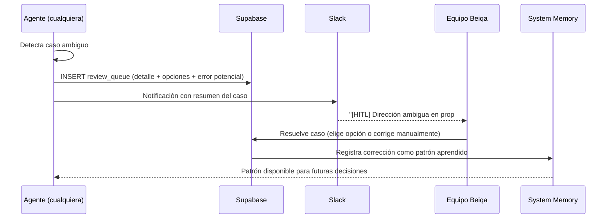
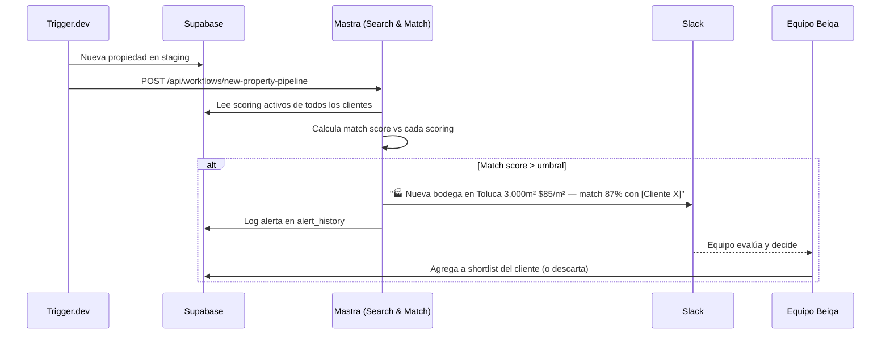
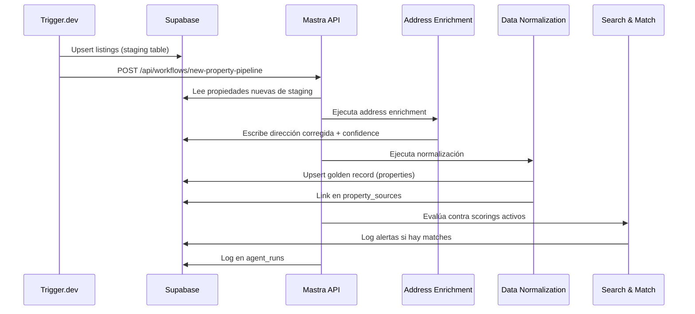
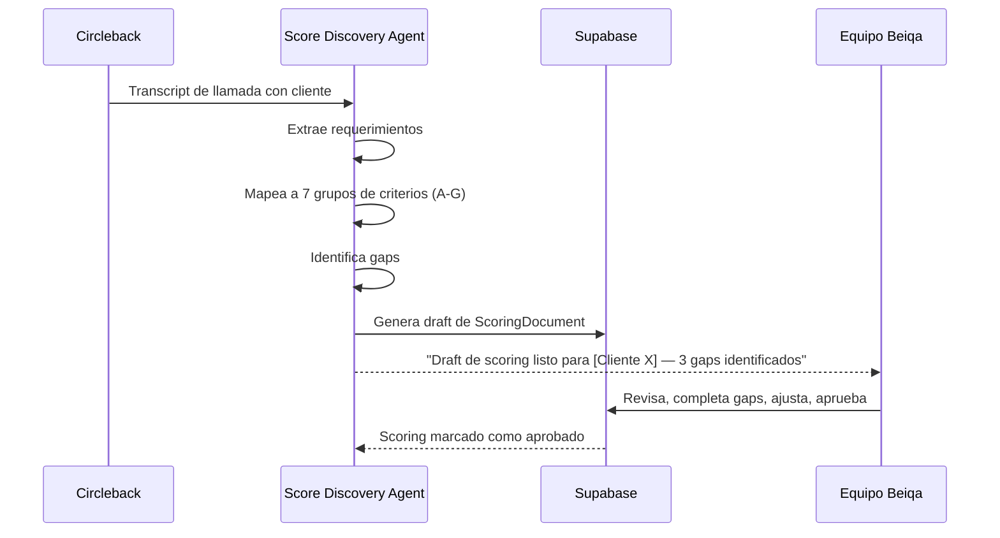
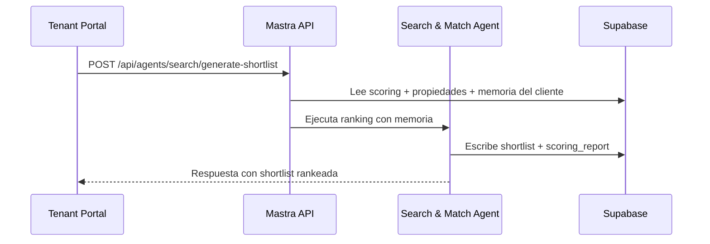
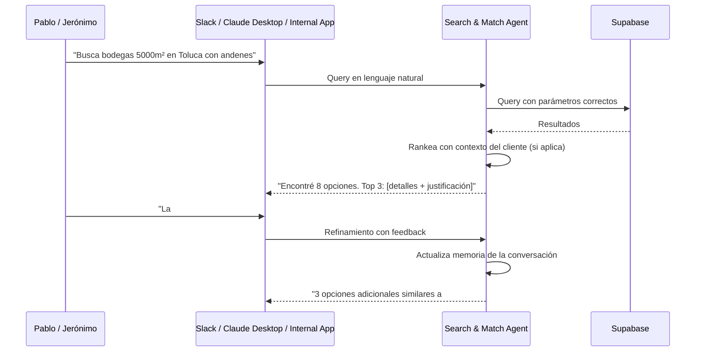

# Arquitectura de Agentes AI — BEIQA Platform

> **Estado**: 🟢 En diseño detallado | **Actualizado**: 2026-03-11
>
> Framework: [Mastra](https://mastra.ai) ([ADR-020](ADRs/ADR-020-Mastra.md)) | Repo: `beiqa-agents` (por crear)
> Separación de responsabilidades: [ADR-021](ADRs/ADR-021-Separacion-Trigger-Mastra.md)

---

## Visión

El AI Brain es la **capa transversal de inteligencia** de la plataforma Beiqa. No es un módulo aislado — provee y consume inteligencia de todos los demás módulos. Implementado con Mastra, orquesta agentes especializados organizados en **3 tiers** según su naturaleza de ejecución:

- **Tier 1 — Data Pipeline**: Agentes que corren en background, automáticamente, procesando datos post-scrape
- **Tier 2 — Client Intelligence**: Agentes interactivos + autónomos que atienden las necesidades de cada cliente
- **Tier 3 — Intelligence & Analysis**: Agentes que generan inteligencia avanzada (geoespacial, mercado)

```
┌──────────────────────────────────────────────────────────────────────────┐
│                        AI BRAIN (Mastra)                                 │
│                  Capa transversal de inteligencia                        │
│                                                                          │
│  ┌─ Tier 1: Data Pipeline (Background, Automated) ────────────────────┐ │
│  │  ┌─────────────────┐  ┌──────────────────┐  ┌──────────────────┐  │ │
│  │  │    Address       │  │      Data        │  │  Deduplication   │  │ │
│  │  │   Enrichment     │  │  Normalization   │  │     Agent        │  │ │
│  │  │   Agent (P0)     │  │   Agent (P0)     │  │     (P1)         │  │ │
│  │  └─────────────────┘  └──────────────────┘  └──────────────────┘  │ │
│  └────────────────────────────────────────────────────────────────────┘ │
│                                                                          │
│  ┌─ Tier 2: Client Intelligence (Interactive + Autonomous) ───────────┐ │
│  │  ┌─────────────────┐  ┌──────────────────────────────────────────┐ │ │
│  │  │ Score Discovery  │  │   Property Search & Match Agent         │ │ │
│  │  │   Agent (P1)     │  │   (P1) — Modo interactivo + autónomo   │ │ │
│  │  │                  │  │   Alertas proactivas + Memoria/cliente  │ │ │
│  │  └─────────────────┘  └──────────────────────────────────────────┘ │ │
│  └────────────────────────────────────────────────────────────────────┘ │
│                                                                          │
│  ┌─ Tier 3: Intelligence & Analysis ──────────────────────────────────┐ │
│  │  ┌──────────────────────────┐  ┌───────────────────────────────┐  │ │
│  │  │    GIS Analysis Agent    │  │  Market Intelligence Agent    │  │ │
│  │  │    (P2) — 10+ fuentes    │  │  (P2) — Reportes + on-demand │  │ │
│  │  └──────────────────────────┘  └───────────────────────────────┘  │ │
│  └────────────────────────────────────────────────────────────────────┘ │
│                                                                          │
│  Cross-cutting: Memoria 3 capas | HITL | Alertas Proactivas            │
│  Tools: Google Geocoding, ArcGIS MCP, H3, PostGIS, LLMs (TBD)         │
└──────────────────────────────────────────────────────────────────────────┘
         │              │              │              │
    ┌────▼────┐   ┌────▼────┐   ┌────▼─────┐  ┌────▼─────────────┐
    │ Scraper │   │  Data   │   │Geospatial│  │Market Intelligence│
    │ Module  │   │ Module  │   │ Module   │  │     Module        │
    └─────────┘   └─────────┘   └──────────┘  └──────────────────┘
```

---

## Agentes — Tabla Resumen

| Agente | Tier | Prioridad | Sprint | Módulo(s) | Estado |
|--------|------|-----------|--------|-----------|--------|
| Address Enrichment | 1: Data Pipeline | **P0** (bloqueador) | 1 | Data, Geospatial | 🔴 Por implementar |
| Data Normalization | 1: Data Pipeline | **P0** | 1-2 | Data | 🔴 Por implementar |
| Deduplication | 1: Data Pipeline | **P1** | 3 | Data | 🔴 Por implementar |
| Score Discovery | 2: Client Intelligence | **P1** | 2-3 | AI Brain, Tenant Portal | 🔴 Por implementar |
| Property Search & Match | 2: Client Intelligence | **P1** | 3-4 | Internal App, Tenant Portal | 🔴 Por implementar |
| GIS Analysis | 3: Intelligence & Analysis | **P2** | 5-6 | Geospatial | 🔴 Por implementar |
| Market Intelligence | 3: Intelligence & Analysis | **P2** | 5-6 | Market Intelligence | 🔴 Por implementar |

> **Nota sobre modelos LLM**: Todos marcados como TBD. La selección de modelo requiere evaluación empírica por agente/tarea, midiendo: costo, calidad (especialmente en español mexicano inmobiliario), velocidad de respuesta, y capacidad de structured output. Mastra permite asignar diferentes modelos por agente.

> **Nota sobre evolución**: Los agentes pueden fusionarse o dividirse según lo dicte la experiencia. La arquitectura debe ser flexible para permitir iteración.

---

## Tier 1: Data Pipeline (Background, Automated)

Agentes que corren automáticamente post-scrape. Se activan via HTTP trigger de Trigger.dev. No requieren interacción humana salvo para casos ambiguos (vía HITL).

### Address Enrichment Agent (P0)

**Problema que resuelve**: 50%+ de las direcciones de portales de alto volumen (Inmuebles24, Pincali) son incorrectas o incompletas. Coordenadas frecuentemente apuntan al centroide de la colonia en lugar de la ubicación real.

**Módulos que sirve**: Data (corrección de datos), Geospatial (coordenadas correctas para H3/AGEB)

**Proceso (multi-señal)**:
1. **Validar coordenadas** — ¿Están dentro de la zona geográfica esperada (CDMX, EdoMex, Morelos, Puebla)?
2. **Geocodificar dirección** — Google Geocoding API: dirección texto → coordenadas
3. **Reverse geocoding** — Google: coordenadas originales → dirección de verificación
4. **Analizar descripción** — LLM: extraer pistas de dirección/ubicación del texto libre de la descripción
5. **Calcular confidence score** — Comparar señales, asignar 0-100
6. **Persistir** — Escribir dirección corregida + confidence a Supabase
7. **Escalar si necesario** — Confidence <50 → review queue (ver sección HITL)

**Tools**:

| Tool | Input | Output | API/Servicio |
|------|-------|--------|-------------|
| `google-geocode` | dirección texto | coordenadas + formatted_address | Google Geocoding API |
| `google-reverse-geocode` | lat/lng | dirección + componentes | Google Geocoding API |
| `coordinate-validator` | lat/lng + zona esperada | boolean + distancia al centroide | PostGIS (ST_Contains) |
| `description-address-extractor` | texto descripción | dirección extraída + landmarks | LLM (TBD) |
| `confidence-scorer` | señales múltiples | score 0-100 + breakdown | Determinístico |

**Output**: `{ corrected_address, corrected_lat, corrected_lng, confidence_score, signals_used }`

**Human-in-the-loop**: Cuando confidence_score < 50, el caso va a review queue con detalle del problema y señales conflictivas. El equipo puede corregir manualmente. La corrección se registra en memoria del sistema para que el agente aprenda y no repita el mismo error.

**Métricas de evaluación**:
- Accuracy: % de direcciones correctas vs verificación manual (target: >80%)
- Cobertura: % de propiedades procesadas (target: 100%)
- Costo por propiedad: $ promedio de APIs + LLM por enriquecimiento

---

### Data Normalization Agent (P0)

**Problema que resuelve**: Las staging tables de cada portal tienen schemas, formatos, y convenciones diferentes. Los datos deben normalizarse a un golden record unificado (`properties`).

**Módulos que sirve**: Data

**Proceso**:
1. **Leer** propiedad de staging table (inmuebles24_listings, pincali_listings, etc.)
2. **Mapear campos** — Cada portal tiene mapeo diferente al golden record
3. **Normalizar valores** — Moneda (MXN/USD), unidades (m²/ft²), tipos de propiedad
4. **Extraer features** — LLM analiza descripción para extraer amenidades, condiciones, etc.
5. **Validar** — Rangos razonables (precio, superficie, coordenadas)
6. **PDF fallback** — Si faltan datos críticos y el portal tiene PDFs (FinSA flyers, CBRE/Colliers fichas), extraer datos estructurados del PDF
7. **Escribir** — Upsert al golden record `properties` + link en `property_sources`
8. **Escalar si necesario** — Datos contradictorios entre fuentes → review queue

**Tools**:

| Tool | Función |
|------|---------|
| `currency-converter` | MXN ↔ USD con tasa actualizada |
| `unit-converter` | m² ↔ ft², hectáreas, etc. |
| `property-type-mapper` | Mapeo de tipos por portal al catálogo Beiqa |
| `feature-extractor` | LLM extrae features de descripción (amenidades, condiciones, etc.) |
| `price-validator` | Valida que precio esté en rango razonable para tipo/zona |
| `pdf-data-extractor` | LLM extrae datos estructurados de PDFs (fichas técnicas, flyers) |

**Métricas**: >95% de campos mapeados correctamente (50 propiedades por portal)

---

### Deduplication Agent (P1)

**Problema que resuelve**: La misma propiedad aparece en múltiples portales con datos ligeramente diferentes. Tabla `possible_duplicates` ya existe pero necesita un pipeline robusto.

**Módulos que sirve**: Data

**Algoritmo (híbrido)**:
1. **Blocking** — Agrupar candidatos por proximidad geográfica (H3 res 9 o PostGIS radius)
2. **Scoring determinístico** — 6 señales: dirección fuzzy match, distancia coordenadas, superficie ±10%, tipo propiedad, precio ±15%, broker
3. **Clasificación**: score >0.95 → auto-merge, score <0.70 → no match, score 0.70-0.95 → LLM resolution
4. **LLM resolution** — Solo para casos ambiguos: el LLM compara descripciones y datos para decidir
5. **Merge** — Combinar mejor información de cada fuente en el golden record
6. **Escalar si necesario** — Casos que el LLM tampoco resuelve con alta confianza → review queue

**Tools**:

| Tool | Función |
|------|---------|
| `h3-blocker` | Agrupa propiedades en mismo hexágono H3 res 9 |
| `postgis-distance` | Calcula distancia entre coordenadas |
| `fuzzy-address-matcher` | Similitud de direcciones (Levenshtein, tokenizado) |
| `dedup-scorer` | Calcula score multi-señal (determinístico) |
| `llm-dedup-resolver` | LLM decide para casos ambiguos (0.70-0.95) |

**Human-in-the-loop**: Pares confirmados o rechazados por el equipo se registran en memoria del sistema. El agente ajusta sus umbrales y aprende qué patrones son duplicados reales vs falsos positivos.

**Métricas**: Precisión >85% (verificación manual de 50 pares), <2% falsos positivos

---

## Tier 2: Client Intelligence (Interactive + Autonomous)

Agentes que sirven directamente al proceso de atención al cliente. Combinan modo interactivo (chatbot para el equipo) y autónomo (procesamiento en background). Mantienen memoria por cliente.

### Score Discovery Agent (P1)

**Problema que resuelve**: Construir el scoring de un cliente a partir de llamadas y conversaciones. Hoy este proceso no funciona — es un PoC que no se usa en producción. El scoring tiene 160+ criterios en 7 grupos, y cada cliente requiere un subconjunto personalizado.

**Módulos que sirve**: AI Brain, Tenant Portal

**Input**:
- Transcripts de llamadas vía Circleback (fuente principal)
- Input manual del equipo cuando falta información o no se preguntó algo en la llamada

**Proceso**:
1. **Procesar transcript** — LLM analiza la conversación y extrae requerimientos del cliente
2. **Identificar tipo de propiedad** — Determinar si es industrial (Grupo B), comercial (C), oficinas (D), terreno (E), o mixto
3. **Activar grupos de criterios** — Grupos A, F, G siempre activos + grupo(s) por tipo de propiedad
4. **Mapear a criterios** — Extraer del transcript los valores para cada criterio relevante
5. **Identificar gaps** — Qué criterios importantes no se mencionaron en la conversación
6. **Generar ScoringDocument** — JSON estructurado con criterios, valores, pesos, y gaps marcados
7. **Presentar para revisión** — El equipo revisa, completa gaps manualmente, y aprueba

**Los 7 Grupos de Criterios** (ver detalle completo en [Research/Scoring-Criteria.md](../01-Modules/AI-Brain/Research/Scoring-Criteria.md)):

| Grupo | Nombre | Criterios aprox. | Cuándo activo |
|-------|--------|-----------------|---------------|
| A | Universal | ~30 | Siempre |
| B | Industrial / Bodega / Manufactura / Logística | ~35 | Si tipo = industrial, bodega, manufactura, CEDIS, almacén |
| C | Comercial / Restaurante / Retail | ~30 | Si tipo = local, restaurante, cafetería, bar, gym, clínica |
| D | Oficinas / Coworking | ~20 | Si tipo = oficinas, coworking, consultorio |
| E | Terreno | ~15 | Si tipo = terreno, BTS |
| F | Operacional del Cliente | ~15 | Siempre (sobre la operación del cliente, no la propiedad) |
| G | Negociación y Contexto | ~15 | Siempre (budget, urgencia, decision maker, proceso) |

**Output**: `ScoringDocument` — JSON/TypeScript schema con:
- Datos del cliente (empresa, contacto, decisor)
- Tipo de propiedad y operación
- Criterios activos con valores extraídos y pesos
- Gaps identificados (criterios sin respuesta)
- Zonas objetivo y excluidas
- Condiciones comerciales

**Tools**:

| Tool | Función |
|------|---------|
| `transcript-parser` | LLM extrae requerimientos de transcript de Circleback |
| `criteria-mapper` | Mapea requerimientos extraídos a los 7 grupos de criterios |
| `scoring-generator` | Genera ScoringDocument estructurado |
| `gap-identifier` | Identifica criterios importantes sin respuesta |

**Interacción con el equipo**: El agente genera un draft del scoring. El equipo (Pablo, Jerónimo) revisa, completa gaps, ajusta pesos, y aprueba. El scoring aprobado se presenta al cliente en el Tenant Portal.

**Métricas**:
- % de criterios correctamente extraídos del transcript (target: >80%)
- % de gaps identificados que el equipo confirma como relevantes (target: >70%)
- Tiempo de generación del draft (target: <5 min por scoring)

---

### Property Search & Match Agent (P1)

**Problema que resuelve**: Cruzar el scoring de cada cliente con propiedades disponibles para generar shortlists rankeadas. Hoy el equipo busca manualmente en portales y arma Excel/PowerPoint. Este agente tiene **dos modos de operación** y mantiene **memoria por cliente**.

**Módulos que sirve**: Internal App, Tenant Portal

#### Modo 1: Interactivo (Chatbot para el equipo)

**Usuarios**: Pablo + Jerónimo (negocio/operaciones)

**Canales**: Slack, Internal App (cuando exista), Claude Desktop/MCP, API

**Cómo funciona**: El equipo le pregunta en lenguaje natural:
- "Busca bodegas de 5,000m² en Toluca con andenes"
- "¿Qué opciones hay para [Cliente X] en la zona de Cuautitlán?"
- "Compara estas 3 propiedades para [Cliente Y]"

El agente:
1. Interpreta la consulta usando el contexto del cliente (scoring + memoria)
2. Construye query a Supabase con los parámetros correctos
3. Filtra y rankea resultados
4. Presenta opciones con justificación
5. Recuerda la conversación para consultas futuras

#### Modo 2: Autónomo (Matching + Alertas Proactivas)

**Trigger**: Cuando llegan propiedades nuevas post-scrape, o periódicamente (cron)

**Cómo funciona**:
1. Toma TODOS los scorings activos de clientes
2. Evalúa propiedades nuevas/actualizadas contra cada scoring
3. Calcula match score por propiedad/cliente
4. Si score > umbral → genera alerta proactiva al equipo
5. El equipo decide si incluir en el shortlist del cliente

**Alertas Proactivas** (ver sección dedicada abajo):
- "Nueva bodega en Toluca de 3,000m² a $85/m² — match 87% con scoring de [Cliente X]"
- Canal: Slack (inmediato) + Internal App (cuando exista)
- El agente NUNCA comunica directamente al cliente — siempre pasa por el equipo

#### Proceso de Generación de Shortlist

1. **Filtrar candidatas** — Query a Supabase con filtros duros del scoring (zona, tipo, superficie mínima, precio máximo)
2. **Rankear con LLM** — Evalúa fit de cada propiedad vs criterios del scoring, considerando pesos y factores cualitativos
3. **Aplicar memoria del cliente** — Penalizar propiedades similares a las que el cliente ya rechazó; priorizar características que el cliente valoró positivamente
4. **Generar shortlist** — Top N propiedades con score por criterio + justificación
5. **Persistir** — Escribir a Supabase para consumo del Tenant Portal

#### Memoria por Cliente

El agente mantiene contexto persistente por cada cliente:
- Qué propiedades se le presentaron y su respuesta (sí/no/quizá + razón)
- Qué criterios valora más en la práctica (vs lo que dice el scoring)
- Historial de visitas a propiedades y outcome
- Comentarios y preferencias expresados en conversaciones
- Qué ajustes se hicieron en rondas anteriores

> **Importante**: La memoria alimenta las búsquedas futuras pero **NO modifica el scoring aprobado** por el cliente. Son dos cosas distintas: el scoring es el contrato, la memoria es el contexto operativo.

**Tools**:

| Tool | Función |
|------|---------|
| `property-filter` | Query a Supabase con filtros del scoring |
| `property-ranker` | LLM evalúa fit propiedad-scoring con pesos y memoria |
| `shortlist-generator` | Genera shortlist rankeada con justificación por criterio |
| `alert-notifier` | Envía alerta a Slack cuando match > umbral |
| `memory-reader` | Lee contexto del cliente (feedback, visitas, preferencias) |
| `memory-writer` | Escribe nuevo contexto del cliente |

**Métricas**:
- Concordancia con evaluación humana del equipo (target: >75%)
- % de alertas proactivas que resultan en propiedades compartidas al cliente (target: >50%)
- Tiempo de respuesta en modo interactivo (target: <30 seg)

---

## Tier 3: Intelligence & Analysis

Agentes que generan inteligencia avanzada para enriquecer el contexto de propiedades y mercado. Alimentan al Tier 2 y al Tenant Portal.

### GIS Analysis Agent (P2)

**Problema que resuelve**: Análisis geoespacial avanzado que va más allá del cálculo H3/AGEB (que se hace por triggers en Supabase). Conecta con 10+ fuentes de datos para generar un **zone quality composite score** diferenciado por tipo de propiedad.

> **Nota**: H3 (res 5-11) y AGEB se calculan automáticamente en Supabase por triggers al insertar/actualizar propiedades. El GIS Agent se encarga del análisis avanzado, no del cálculo básico.

**Módulos que sirve**: Geospatial

**Fuentes de datos (10+)**:

| Fuente | Tipo | Datos que provee | Acceso |
|--------|------|-----------------|--------|
| INEGI DENUE | Gobierno | Establecimientos económicos, actividad comercial | API pública |
| INEGI AGEB | Gobierno | Datos censales por área geoestadística | Shapefiles / API |
| INEGI Socioeconómico | Gobierno | NSE, población, ingreso, educación | API / descarga |
| Google Places | Comercial | Negocios cercanos, POIs, ratings | API (pagada) |
| Google Distance Matrix | Comercial | Tiempos de traslado, rutas | API (pagada) |
| ArcGIS | Comercial | Análisis espacial avanzado, geoprocesamiento | MCP server |
| Catastro | Gobierno | Uso de suelo, zonificación, valor catastral | API / manual (TBD) |
| Foot traffic APIs | Comercial | Tráfico peatonal, afluencia por hora/día | TBD (Placer.ai, SafeGraph, etc.) |
| Heat maps | Varios | Densidad de actividad por zona | Derivado de fuentes anteriores |
| D9 / Otras | Varios | Datos complementarios | TBD |

> **Nota**: Las fuentes se irán agregando incrementalmente. No todas estarán disponibles en Sprint 5. Prioridad: INEGI + Google + ArcGIS primero, las demás después.

**Análisis diferenciado por tipo de propiedad**:

| Tipo | Factores de análisis | Ejemplos |
|------|---------------------|----------|
| **Industrial** | Acceso logístico, infraestructura | Distancia a autopistas, aeropuertos, puertos/aduanas, zonas industriales, acceso ferroviario |
| **Comercial / Retail** | Demanda y competencia | Tráfico peatonal, NSE del área, densidad de competencia, flujo peatonal por horario |
| **Oficinas** | Conectividad y servicios | Distancia a metro (minutos + líneas), transporte público, clasificación del edificio, amenidades zona |
| **Terreno** | Potencial de desarrollo | Uso de suelo permitido, CUS/COS, servicios disponibles, acceso carretero |

**Output**: Zone Quality Report por propiedad:
```json
{
  "property_id": "...",
  "zone_quality_score": 78,
  "breakdown": {
    "accessibility": 85,
    "economic_activity": 72,
    "infrastructure": 80,
    "competition_context": 65
  },
  "proximity_analysis": [
    { "poi": "Autopista México-Querétaro", "distance_km": 2.3, "drive_min": 5 },
    { "poi": "Metro más cercano", "distance_km": 12.1, "walk_min": null }
  ],
  "socioeconomic": {
    "nse_predominant": "C+",
    "population_radius_2km": 45000,
    "economic_units_radius_1km": 234
  },
  "sources_used": ["inegi_denue", "google_places", "google_distance_matrix"]
}
```

**Tools**:

| Tool | Función |
|------|---------|
| `inegi-denue-query` | Consulta establecimientos económicos por zona |
| `inegi-socioeconomic` | Datos socioeconómicos por AGEB |
| `google-places-nearby` | POIs y negocios cercanos |
| `google-distance-matrix` | Tiempos de traslado a puntos clave |
| `arcgis-mcp` | Análisis espacial avanzado vía MCP server |
| `zone-quality-scorer` | Score compuesto de calidad de zona (fórmula diferenciada por tipo) |
| `proximity-calculator` | Distancia y tiempo a puntos de interés relevantes |

**Métricas**:
- Accuracy de clasificación de zona vs evaluación humana (target: >80%)
- Cobertura: % de propiedades con análisis GIS completo (target: >70% del golden record)
- Costo mensual de APIs (target: dentro de presupuesto Google Maps Platform)

---

### Market Intelligence Agent (P2)

**Problema que resuelve**: Generar inteligencia de mercado automatizada — tendencias de precio, análisis de oferta/demanda, comparables por zona. Hoy no existe ningún reporte automatizado.

**Módulos que sirve**: Market Intelligence

**Tres modos de operación**:

#### 1. Reportes periódicos automáticos

Se generan por cron (semanal/mensual) sin intervención humana:
- Precio/m² promedio por zona (H3 res 7 o AGEB) y tipo de propiedad
- Inventario disponible por zona (activas, nuevas, retiradas)
- Tendencias de precio vs periodo anterior
- Tasa de absorción estimada

#### 2. Análisis comparativo on-demand

El equipo solicita comparativos específicos:
- "Compara Toluca vs Cuautitlán para bodegas de 5,000m²"
- "¿Cómo están los precios de oficinas clase A en Polanco vs Santa Fe?"
- "Dame el inventario de locales comerciales en Naucalpan"

#### 3. Narrativa en lenguaje natural

LLM genera resúmenes ejecutivos que explican los datos:
- "El precio promedio de bodegas en el corredor Cuautitlán-Tultitlán subió 8% vs Q4 2025, impulsado por nueva demanda logística de e-commerce. El inventario disponible se redujo 15%, sugiriendo un mercado de propietarios."

**Tools**:

| Tool | Función |
|------|---------|
| `price-trend-calculator` | Calcula tendencias de precio por zona/tipo |
| `supply-analyzer` | Inventario y tasa de absorción por zona |
| `comparables-finder` | Propiedades similares en zona cercana |
| `zone-stats` | Estadísticas agregadas por H3/AGEB |
| `narrative-generator` | LLM genera resumen ejecutivo de mercado |

**Métricas**:
- Relevancia de insights (evaluación humana, target: >70%)
- Accuracy de datos agregados vs cálculo manual (target: >95%)
- Cobertura de zonas con reportes (target: todas las zonas con >10 propiedades)

---

## Arquitectura de Memoria (3 Capas)

Los agentes necesitan memoria para aprender de correcciones, mantener contexto por cliente, y mejorar con el tiempo. La arquitectura tiene 3 capas:

```
┌──────────────────────────────────────────────────────────────┐
│  Layer 3: System Memory (Mastra)                              │
│  Patrones de corrección, aprendizaje global, errores comunes │
│  → Todos los agentes contribuyen y leen                      │
├──────────────────────────────────────────────────────────────┤
│  Layer 2: Agent-Specific Memory (Mastra)                      │
│  Reasoning traces, decisiones, historial por agente          │
│  → Cada agente escribe la suya, lee solo la suya             │
├──────────────────────────────────────────────────────────────┤
│  Layer 1: Shared Client Context (Supabase)                    │
│  Datos estructurados: scoring, feedback, visitas, shortlists │
│  → Todos los agentes leen, agentes específicos escriben      │
└──────────────────────────────────────────────────────────────┘
```

### Layer 1: Shared Client Context (Supabase)

Datos estructurados en tablas relacionales. Source of truth para información del cliente.

| Tabla | Qué contiene | Quién escribe | Quién lee |
|-------|-------------|---------------|-----------|
| `scoring_documents` | Scoring aprobado del cliente (criterios, pesos, zonas) | Score Discovery Agent | Property Search & Match, todos |
| `client_feedback` | Feedback del cliente por propiedad (sí/no/quizá + razón) | Tenant Portal (vía API) | Property Search & Match |
| `property_visits` | Visitas agendadas y sus outcomes | Equipo Beiqa (manual) | Property Search & Match |
| `shortlists` | Shortlists generados y su historial | Property Search & Match | Tenant Portal, equipo |
| `scoring_reports` | Reportes de scoring con resultados | Property Search & Match | Tenant Portal |

### Layer 2: Agent-Specific Memory (Mastra)

Memoria persistente por agente usando Mastra Memory API (backed by Supabase).

| Agente | Qué recuerda |
|--------|-------------|
| Address Enrichment | Patrones de direcciones por colonia, correcciones exitosas, señales más confiables por zona |
| Data Normalization | Mapeos especiales por portal, features que el LLM extrae correctamente vs no |
| Deduplication | Pares confirmados/rechazados por el equipo, umbrales ajustados |
| Score Discovery | Estilo de cada cliente para expresar requerimientos, criterios que siempre olvidan mencionar |
| Property Search & Match | **Por cliente**: qué le gustó/no le gustó, visitas, preferencias implícitas, historial de búsquedas |

### Layer 3: System Memory (Mastra)

Aprendizaje global que todos los agentes comparten.

| Patrón | Ejemplo |
|--------|---------|
| Correcciones recurrentes | "Direcciones de colonia X en portal Y siempre apuntan al centroide" |
| Data quality patterns | "Precios de Pincali siempre vienen en MXN, nunca USD" |
| Business rules aprendidas | "Cliente tipo logística siempre necesita andenes aunque no lo mencione" |

> **Implementación**: Mastra ofrece persistent memory (Supabase-backed), shared memory (cross-agent), y RAG para búsqueda semántica sobre memoria. Ver [Research/Memory-Architecture.md](../01-Modules/AI-Brain/Research/Memory-Architecture.md) para el diseño detallado.

---

## Human-in-the-Loop (HITL)

Los agentes no son infalibles. Cuando encuentran casos ambiguos, deben escalar al equipo en lugar de adivinar.

### Flujo de escalamiento



### Cuándo escalar

| Agente | Condición de escalamiento |
|--------|--------------------------|
| Address Enrichment | confidence_score < 50, señales contradictorias |
| Data Normalization | Datos contradictorios entre fuentes, valores fuera de rango |
| Deduplication | Score 0.70-0.95 que el LLM tampoco resuelve con alta confianza |
| Score Discovery | Criterios ambiguos del transcript, gaps críticos sin respuesta |
| Property Search & Match | Match borderline, cliente con historial contradictorio |

### Interfaz de resolución

- **Hoy (transitorio)**: Slack (notificación + conversación) + Rube/Claude Desktop
- **Futuro (Sprint 5+)**: Internal App con secciones dedicadas:
  - **Cola de revisión**: Casos pendientes ordenados por prioridad
  - **Tracking**: Historial de casos resueltos
  - **Feedback**: Input directo al agente con contexto

### Aprendizaje

Cada resolución humana se registra como patrón en System Memory (Layer 3). Esto permite:
- **Reducir escalamientos** con el tiempo (el agente aprende los patrones del equipo)
- **No repetir errores** (si el equipo corrige un error, no debe pasar dos veces)
- **Auditoría** (registro completo de qué decidió el humano y por qué)

---

## Alertas Proactivas

Las alertas proactivas son un **diferenciador clave del negocio**: el equipo Beiqa se entera automáticamente cuando aparece una propiedad que matchea un cliente activo, antes que cualquier broker competidor.

### Flujo



### Reglas

1. El agente **NUNCA** comunica directamente al cliente. Siempre pasa por el equipo
2. El umbral de match es configurable por cliente (default: 70%)
3. Las alertas incluyen: propiedad, score, cliente que matchea, top 3 criterios que matchean
4. Frecuencia: inmediata post-scrape (no batch)
5. Canal: Slack inicialmente, Internal App después

---

## Feedback Loop del Cliente

El ciclo de feedback es uno de los mecanismos más importantes del sistema:

```
Cliente recibe shortlist en Tenant Portal
    → Evalúa cada propiedad (Sí / No / Quizá)
    → Agrega razón (precio, ubicación, tamaño, etc.)
    → Opcionalmente agrega comentario
        → Feedback se almacena en client_feedback (Layer 1)
        → Property Search & Match Agent lee feedback
        → Siguiente shortlist incorpora aprendizaje
            → Penaliza propiedades similares a las rechazadas
            → Prioriza características de las aprobadas
```

> **Regla crítica**: El feedback alimenta la memoria del agente, pero **NUNCA modifica el scoring aprobado** por el cliente. El scoring es el contrato; el feedback es inteligencia operativa.

---

## Patrones de Comunicación

### Trigger.dev → Mastra (post-scrape — pipeline completo)



### Circleback → Score Discovery (generación de scoring)



### Frontend → Mastra (scoring on-demand)



### Equipo → Mastra (consulta interactiva)



---

## Estrategia de MCP

Mastra actúa como **MCP client** que consume servicios externos, y puede exponer sus propias capacidades como **MCP server**.

### MCP Servers consumidos

| MCP Server | Proveedor | Qué consume |
|-----------|-----------|-------------|
| ArcGIS Location Services | ArcGIS / comunidad | Geoprocesamiento avanzado, análisis espacial |
| GIS-MCP | Comunidad (GitHub) | Operaciones geométricas, transformaciones |
| Supabase MCP | Supabase | Queries directas a la DB (alternativa a client) |

### MCP Servers expuestos por Mastra

| MCP Server | Qué ofrece | Consumidores |
|-----------|-----------|-------------|
| Scoring API | Generación de shortlists, búsqueda de propiedades | Claude Desktop / Rube |
| Market Intelligence | Reportes de mercado, comparativos | Claude Desktop / Rube |
| Property Search | Búsqueda inteligente con contexto | Claude Desktop / Rube |

---

## Estrategia de Modelos LLM

**Estado: TBD — requiere evaluación empírica.**

Cada agente y cada tool que use LLM debe evaluarse con al menos 2-3 modelos antes de elegir. Mastra permite asignar diferentes modelos por agente.

### Métricas de evaluación por modelo

| Métrica | Cómo se mide | Importancia |
|---------|-------------|-------------|
| Calidad en español | Accuracy de extracción en texto mexicano inmobiliario | Alta |
| Structured output | % de respuestas que parsean correctamente al schema esperado | Alta |
| Costo por llamada | $ promedio por request | Media |
| Latencia | ms promedio de respuesta | Baja (batch) / Alta (interactivo) |
| Consistencia | Varianza en respuestas para el mismo input | Media |

### Candidatos a evaluar

- Claude (Haiku, Sonnet, Opus) — vía API directa
- GPT-4o, GPT-4o-mini — vía OpenAI API o OpenRouter
- Modelos open-source (Llama, Mistral) — vía OpenRouter o self-hosted

La selección final se documenta por agente conforme se implemente y evalúe.

---

## Schema de Supabase (cambios necesarios)

### Tablas nuevas

| Tabla | Propósito | Columnas clave |
|-------|----------|---------------|
| `properties` | Golden record (deduplicado, normalizado, enriquecido) | id, normalized_address, corrected_lat/lng, confidence_score, property_type, operation_type, price, currency, surface_m2, h3_res5/7/9/11, ageb_id, status, first_seen_at, last_seen_at |
| `property_sources` | Links staging → golden record | property_id, source_table, source_id, source_portal |
| `agent_runs` | Log de ejecuciones de agentes | id, agent_name, input, output, model_used, tokens_used, cost_usd, duration_ms, status, created_at |
| `enrichment_queue` | Cola de propiedades pendientes de enriquecer | id, source_table, source_id, status (pending/processing/done/error), priority, attempts |
| `scoring_documents` | Scoring aprobado del cliente | id, tenant_id, status (draft/approved), criteria_groups (JSONB), zones, created_at, approved_at |
| `scoring_reports` | Reportes de scoring generados | id, tenant_id, scoring_document_id, shortlist (JSONB), created_at |
| `scoring_results` | Resultados por propiedad | report_id, property_id, total_score, score_breakdown (JSONB), justification |
| `client_feedback` | Feedback del cliente por propiedad | id, tenant_id, property_id, evaluation (si/no/quiza), reason, comment, created_at |
| `property_visits` | Visitas agendadas y outcomes | id, tenant_id, property_id, visit_date, outcome, notes, created_at |
| `review_queue` | Cola HITL para casos ambiguos | id, agent_name, case_type, detail (JSONB), options (JSONB), status (pending/resolved), resolved_by, resolution, created_at, resolved_at |
| `alert_history` | Historial de alertas proactivas | id, tenant_id, property_id, match_score, scoring_document_id, channel, status (sent/acted/dismissed), created_at |
| `market_reports` | Reportes de inteligencia de mercado | id, zone_h3, zone_ageb, report_type (periodic/on-demand), content (JSONB), narrative, created_at |

### Columnas nuevas en staging tables

En todas las staging tables (inmuebles24_listings, pincali_listings, finsa_listings, cbre_listings, colliers_listings):
- `enrichment_status` (enum: pending, processing, done, error)
- `address_confidence_score` (integer 0-100)
- `address_corrected` (boolean)
- `golden_record_id` (FK → properties)

---

## Estrategia de Implementación

**Principio**: Diseño completo, implementación incremental. Scrum horizontal — cada sprint avanza en múltiples módulos.

**División de trabajo**: Fabrizio construye la mayoría (infraestructura, Mastra setup, lógica de agentes, Trigger.dev integration). Pablo apoya en diseño de agentes y criterios de scoring.

### Fase 1: Foundation (Sprints 1-2)
- Address Enrichment Agent (P0)
- Data Normalization Agent (P0)
- Schema changes en Supabase (golden record + tablas de soporte)
- Trigger.dev → Mastra HTTP trigger
- Infraestructura HITL básica (review_queue + Slack)

### Fase 2: Client Intelligence (Sprints 2-4)
- Score Discovery Agent (P1)
- Property Search & Match Agent — modo autónomo + alertas (P1)
- Property Search & Match Agent — modo interactivo (P1)
- Deduplication Agent (P1)
- Backfill completo de ~30K propiedades (I24 + portales custom)

### Fase 3: Advanced Intelligence (Sprints 5-6)
- GIS Analysis Agent (P2)
- Market Intelligence Agent (P2)
- Evals completos y optimización
- Pipeline end-to-end

> Ver [Roadmap](../03-Roadmap/Roadmap.md) para el detalle de cada sprint con OKRs, deliverables, y acceptance criteria.

---

## Evaluaciones (Evals)

Cada agente debe tener evaluaciones que midan su calidad. Mastra incluye un sistema de evals built-in.

| Agente | Eval principal | Target | Dataset |
|--------|---------------|--------|---------|
| Address Enrichment | % direcciones correctas vs verificación manual | >80% | 100 propiedades random de cada portal |
| Data Normalization | % campos mapeados correctamente | >95% | 50 propiedades por portal |
| Deduplication | Precisión de pares detectados | >85% | 50 pares verificados manualmente |
| Score Discovery | % criterios extraídos correctamente del transcript | >80% | 10 scorings con transcript real |
| Property Search & Match | Concordancia con evaluación humana | >75% | 20 scorings comparados con criterio de Pablo |
| GIS Analysis | Accuracy de zona vs evaluación humana | >80% | 50 propiedades con análisis manual |
| Market Intelligence | Relevancia de insights (evaluación humana) | >70% | 10 reportes revisados |

---

*Documento creado: 2026-03-05 | Última actualización: 2026-03-11*
*Vinculado a [ADR-020](ADRs/ADR-020-Mastra.md), [ADR-021](ADRs/ADR-021-Separacion-Trigger-Mastra.md)*
*Criterios de scoring: [Research/Scoring-Criteria.md](../01-Modules/AI-Brain/Research/Scoring-Criteria.md)*
*Memoria: [Research/Memory-Architecture.md](../01-Modules/AI-Brain/Research/Memory-Architecture.md)*
*GIS: [Research/GIS-Analysis-Strategy.md](../01-Modules/AI-Brain/Research/GIS-Analysis-Strategy.md)*
