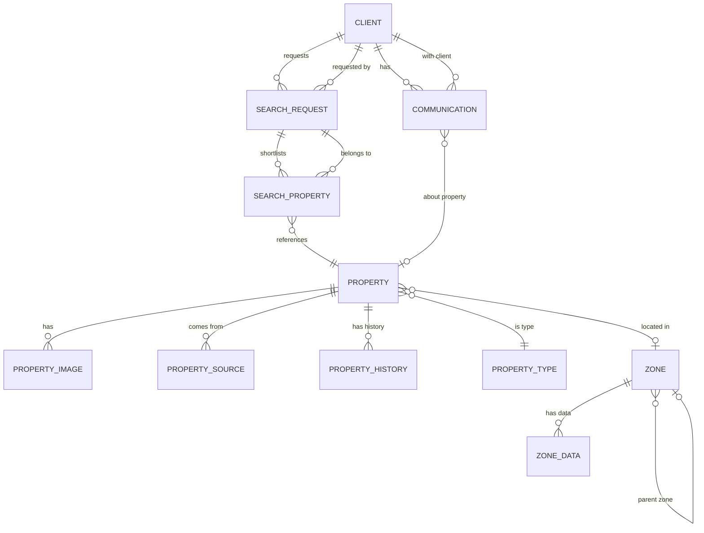

# Modelo de Datos - BEIQA Platform

> ⚠️ **Nota importante**: Este modelo es la visión original de discovery (febrero 2026). El schema implementado en producción tiene una estructura diferente.
>
> **Para el schema real que está corriendo en Supabase, ver: [Schema-Real.md](./Schema-Real.md)**

## Objetivo

Definir las entidades principales y sus relaciones para la base de datos centralizada.

**Estado**: 📚 Referencia histórica — visión original de discovery

---

## Diagrama de Entidades Principal



---

## Entidades Principales

### 1. PROPERTY (Propiedad)

Representa un inmueble comercial/industrial.

| Campo | Tipo | Nullable | Descripción |
|-------|------|----------|-------------|
| id | UUID | No | Identificador único interno |
| external_id | String | Sí | ID compuesto de fuentes externas |
| title | String | No | Título del listing |
| description | Text | Sí | Descripción completa |
| property_type_id | FK | No | Tipo de inmueble |
| operation_type | Enum | No | 'rent', 'sale', 'both' |
| price_rent | Decimal | Sí | Precio de renta mensual |
| price_sale | Decimal | Sí | Precio de venta |
| currency | Enum | No | 'MXN', 'USD' |
| surface_m2 | Decimal | Sí | Superficie en m² |
| address_text | String | Sí | Dirección textual |
| location | Geography(Point) | Sí | Coordenadas (PostGIS) |
| geocoding_confidence | Float | Sí | Confianza del geocoding (0-1) |
| zone_id | FK | Sí | Zona donde se ubica |
| status | Enum | No | 'active', 'rented', 'sold', 'inactive' |
| first_seen_at | Timestamp | No | Primera vez detectada |
| last_seen_at | Timestamp | No | Última vez detectada |
| created_at | Timestamp | No | Fecha creación registro |
| updated_at | Timestamp | No | Última actualización |

**Índices sugeridos**:
- `idx_property_location` - GIST index en location
- `idx_property_type_status` - Tipo + status
- `idx_property_zone` - Zone_id

---

### 2. PROPERTY_TYPE (Tipo de Inmueble)

Catálogo de tipos de inmueble.

| Campo | Tipo | Nullable | Descripción |
|-------|------|----------|-------------|
| id | Integer | No | PK |
| code | String | No | Código único ('warehouse', 'office', etc.) |
| name_es | String | No | Nombre en español |
| name_en | String | Sí | Nombre en inglés |
| category | Enum | No | 'industrial', 'commercial', 'office' |

**Valores iniciales**:
- warehouse (Bodega) - industrial
- office (Oficina) - office
- retail (Local comercial) - commercial
- land (Terreno) - land
- mixed_use (Uso mixto) - commercial

---

### 3. PROPERTY_SOURCE (Fuente de Propiedad)

Tracking de dónde viene cada propiedad (para deduplicación).

| Campo | Tipo | Nullable | Descripción |
|-------|------|----------|-------------|
| id | UUID | No | PK |
| property_id | FK | No | Propiedad relacionada |
| source_type | Enum | No | 'scraper', 'manual', 'api' |
| source_name | String | No | Nombre del portal/fuente |
| external_id | String | No | ID en el portal externo |
| external_url | URL | Sí | URL del listing original |
| last_scraped_at | Timestamp | No | Última extracción |
| raw_data | JSONB | Sí | Datos crudos originales |

---

### 4. PROPERTY_IMAGE (Imagen de Propiedad)

| Campo | Tipo | Nullable | Descripción |
|-------|------|----------|-------------|
| id | UUID | No | PK |
| property_id | FK | No | Propiedad relacionada |
| url | URL | No | URL de la imagen |
| storage_path | String | Sí | Path si almacenamos localmente |
| order | Integer | No | Orden de display |
| is_primary | Boolean | No | Es la imagen principal |

---

### 5. CLIENT (Cliente)

Clientes de Beiqa (tenants corporativos).

| Campo | Tipo | Nullable | Descripción |
|-------|------|----------|-------------|
| id | UUID | No | PK |
| company_name | String | No | Nombre de la empresa |
| contact_name | String | Sí | Nombre del contacto principal |
| contact_email | String | Sí | Email de contacto |
| contact_phone | String | Sí | Teléfono de contacto |
| hubspot_id | String | Sí | ID en HubSpot CRM |
| status | Enum | No | 'active', 'inactive', 'closed' |
| created_at | Timestamp | No | |
| updated_at | Timestamp | No | |

---

### 6. SEARCH_REQUEST (Solicitud de Búsqueda)

Una solicitud de búsqueda de un cliente.

| Campo | Tipo | Nullable | Descripción |
|-------|------|----------|-------------|
| id | UUID | No | PK |
| client_id | FK | No | Cliente que solicita |
| name | String | No | Nombre de la búsqueda |
| property_types | Array | No | Tipos de inmueble buscados |
| operation_type | Enum | No | 'rent', 'sale' |
| min_surface | Decimal | Sí | Superficie mínima |
| max_surface | Decimal | Sí | Superficie máxima |
| min_price | Decimal | Sí | Precio mínimo |
| max_price | Decimal | Sí | Precio máximo |
| target_zones | Array | Sí | Zonas preferidas |
| target_geometry | Geography | Sí | Área de interés (polígono) |
| special_requirements | Text | Sí | Requisitos especiales |
| status | Enum | No | 'active', 'paused', 'completed', 'cancelled' |
| created_at | Timestamp | No | |
| updated_at | Timestamp | No | |

---

### 7. SEARCH_PROPERTY (Propiedad en Shortlist)

Propiedades shortlisted para una búsqueda.

| Campo | Tipo | Nullable | Descripción |
|-------|------|----------|-------------|
| id | UUID | No | PK |
| search_request_id | FK | No | Búsqueda relacionada |
| property_id | FK | No | Propiedad relacionada |
| match_score | Float | Sí | Score de matching (AI) |
| status | Enum | No | 'suggested', 'reviewing', 'presented', 'rejected', 'interested' |
| internal_notes | Text | Sí | Notas internas de Beiqa |
| client_feedback | Text | Sí | Feedback del cliente |
| added_at | Timestamp | No | Cuándo se agregó |
| added_by | Enum | No | 'ai', 'manual' |

---

### 8. COMMUNICATION (Comunicación)

Registro de comunicaciones con clientes.

| Campo | Tipo | Nullable | Descripción |
|-------|------|----------|-------------|
| id | UUID | No | PK |
| client_id | FK | No | Cliente relacionado |
| property_id | FK | Sí | Propiedad relacionada (si aplica) |
| channel | Enum | No | 'email', 'whatsapp', 'phone', 'meeting' |
| direction | Enum | No | 'inbound', 'outbound' |
| subject | String | Sí | Asunto (para emails) |
| content | Text | Sí | Contenido/transcripción |
| summary | Text | Sí | Resumen generado por AI |
| sentiment | Enum | Sí | 'positive', 'neutral', 'negative' |
| external_id | String | Sí | ID en sistema externo |
| occurred_at | Timestamp | No | Cuándo ocurrió |
| created_at | Timestamp | No | Cuándo se registró |

---

### 9. ZONE (Zona Geográfica)

Zonas para análisis (AGEB, colonias, municipios, etc.).

| Campo | Tipo | Nullable | Descripción |
|-------|------|----------|-------------|
| id | UUID | No | PK |
| code | String | No | Código único (AGEB, CP, etc.) |
| name | String | No | Nombre de la zona |
| zone_type | Enum | No | 'country', 'state', 'municipality', 'locality', 'ageb', 'cp', 'custom' |
| parent_id | FK | Sí | Zona padre (jerarquía) |
| geometry | Geography(Polygon) | Sí | Polígono de la zona |
| centroid | Geography(Point) | Sí | Centro geográfico |

---

### 10. ZONE_DATA (Datos de Zona)

Indicadores por zona (poblacional, económico, etc.).

| Campo | Tipo | Nullable | Descripción |
|-------|------|----------|-------------|
| id | UUID | No | PK |
| zone_id | FK | No | Zona relacionada |
| indicator_code | String | No | Código del indicador |
| value | Float | Sí | Valor numérico |
| value_text | String | Sí | Valor textual (si aplica) |
| year | Integer | No | Año del dato |
| source | String | No | Fuente (INEGI, etc.) |
| created_at | Timestamp | No | |

**Indicadores típicos**:
- population (Población)
- population_density (Densidad poblacional)
- households (Hogares)
- avg_income (Ingreso promedio)
- socioeconomic_level (NSE)
- economic_units (Unidades económicas)

---

## Entidades de Inteligencia de Mercado

### 11. MARKET_PRICE (Precio de Mercado)

| Campo | Tipo | Nullable | Descripción |
|-------|------|----------|-------------|
| id | UUID | No | PK |
| zone_id | FK | No | Zona |
| property_type_id | FK | No | Tipo de inmueble |
| period | Date | No | Período (mes/año) |
| avg_price_m2_rent | Decimal | Sí | Precio promedio renta/m² |
| avg_price_m2_sale | Decimal | Sí | Precio promedio venta/m² |
| sample_size | Integer | No | Tamaño de muestra |
| min_price | Decimal | Sí | Precio mínimo observado |
| max_price | Decimal | Sí | Precio máximo observado |

---

### 12. VACANCY_RATE (Tasa de Vacancia)

| Campo | Tipo | Nullable | Descripción |
|-------|------|----------|-------------|
| id | UUID | No | PK |
| zone_id | FK | No | Zona |
| property_type_id | FK | No | Tipo de inmueble |
| period | Date | No | Período |
| vacancy_rate | Float | No | Tasa de vacancia (0-1) |
| total_inventory | Integer | Sí | Inventario total |
| vacant_units | Integer | Sí | Unidades vacantes |

---

## Relaciones Clave

```
PROPERTY <--> PROPERTY_SOURCE (1:N) - Una propiedad puede venir de múltiples fuentes
PROPERTY <--> PROPERTY_IMAGE (1:N) - Una propiedad tiene múltiples imágenes
PROPERTY --> ZONE (N:1) - Cada propiedad está en una zona
PROPERTY --> PROPERTY_TYPE (N:1) - Cada propiedad es de un tipo

CLIENT <--> SEARCH_REQUEST (1:N) - Un cliente puede tener múltiples búsquedas
CLIENT <--> COMMUNICATION (1:N) - Un cliente tiene múltiples comunicaciones

SEARCH_REQUEST <--> SEARCH_PROPERTY (1:N) - Una búsqueda tiene múltiples propiedades shortlisted
SEARCH_PROPERTY --> PROPERTY (N:1) - Referencia a la propiedad

ZONE <--> ZONE (self, parent) - Jerarquía de zonas
ZONE <--> ZONE_DATA (1:N) - Una zona tiene múltiples indicadores
```

---

## Consideraciones Técnicas

### Tipos de datos especiales (PostgreSQL + PostGIS)

- `Geography(Point, 4326)` - Coordenadas en WGS84
- `Geography(Polygon, 4326)` - Polígonos de zonas
- `JSONB` - Datos semi-estructurados (raw data del scraper)
- `Array` - Arrays de PostgreSQL para listas simples

### Índices recomendados

```sql
-- Índices geoespaciales
CREATE INDEX idx_property_location ON property USING GIST(location);
CREATE INDEX idx_zone_geometry ON zone USING GIST(geometry);

-- Índices de búsqueda común
CREATE INDEX idx_property_type_status ON property(property_type_id, status);
CREATE INDEX idx_property_zone ON property(zone_id);
CREATE INDEX idx_search_client_status ON search_request(client_id, status);
```

---

## Próximos Pasos

1. [ ] Validar modelo con equipo técnico
2. [ ] Agregar campos específicos por tipo de inmueble
3. [ ] Definir estrategia de particionamiento (si necesario)
4. [ ] Crear migraciones de base de datos
5. [ ] Documentar en ADR

---

## Preguntas Abiertas

1. ¿Necesitamos tablas separadas por tipo de inmueble (bodega, oficina)?
2. ¿Cómo manejamos el histórico de precios de una propiedad?
3. ¿Almacenamos geometrías o solo referencias a archivos GeoJSON?
4. ¿Qué nivel de jerarquía de zonas necesitamos?
