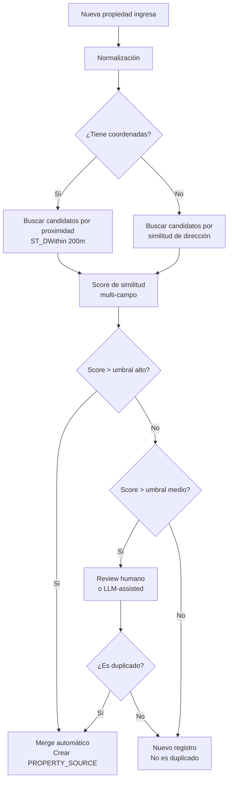

# Estrategia de Deduplicación de Propiedades

**Fase**: R-1 (Datos Core)
**Estado**: 🔴 Por investigar
**Depende de**: Data Acquisition Strategy

---

## Objetivo

Definir cómo identificar y fusionar registros duplicados de propiedades. Una misma propiedad puede aparecer 5-7 veces en un solo portal (diferentes agentes listando el mismo espacio). Sin deduplicación, la base de datos es inútil.

---

## El Problema

| Dimensión | Detalle |
|-----------|---------|
| Origen | Múltiples agentes publican la misma propiedad |
| Frecuencia | 5-7 duplicados por propiedad (según entrevista) |
| Fuente | Mismo portal (EasyBroker) y entre portales |
| Datos no idénticos | Cada agente describe diferente: precio varía, fotos diferentes, dirección con variantes |
| Impacto | Base de datos inflada, métricas de mercado distorsionadas, experiencia de usuario confusa |

---

## Campos para Identificar Duplicados

| Campo | Utilidad para Dedup | Confiabilidad | Notas |
|-------|---------------------|---------------|-------|
| Dirección (texto) | Alta | Media | Variantes en escritura, abreviaciones |
| Coordenadas (lat/lon) | Alta | Alta (si disponible) | No siempre están, precisión variable |
| Superficie (m2) | Media | Media | Puede variar ±10% entre publicaciones |
| Precio (renta/venta) | Media | Baja | Varía entre agentes, cambia en el tiempo |
| Tipo de propiedad | Filtro previo | Alta | Mismo tipo para ser candidato |
| Fotos | Alta | Media | Mismas fotos = alta probabilidad de duplicado |
| ID del portal | N/A intra-portal | Alta | Diferentes IDs para misma propiedad |
| Nombre del edificio/parque | Alta | Media | Si está disponible, buen identificador |

---

## Algoritmos y Técnicas a Investigar

### 1. Similitud de Texto (Direcciones)

| Técnica | Descripción | Pros | Contras |
|---------|-------------|------|---------|
| Levenshtein Distance | Distancia de edición entre strings | Simple, rápido | Sensible a formato |
| Jaro-Winkler | Similitud ponderada al inicio | Bueno para nombres | Menos preciso con formatos variados |
| TF-IDF + Cosine | Vectorización de texto | Maneja variantes | Más complejo |
| Normalización previa | Estandarizar formato antes de comparar | Mejora todos los métodos | Requiere reglas de negocio |

### 2. Proximidad Geográfica (Coordenadas)

| Técnica | Descripción | Umbral sugerido |
|---------|-------------|-----------------|
| Distancia Haversine | Distancia entre dos coordenadas | < 100m = candidato |
| PostGIS ST_DWithin | Query espacial en DB | Configurable |
| Clustering geográfico | Agrupar puntos cercanos | DBSCAN, K-means |

### 3. Similitud de Imágenes (Fotos)

| Técnica | Descripción | Pros | Contras |
|---------|-------------|------|---------|
| Perceptual Hash (pHash) | Hash que tolera pequeños cambios | Rápido, efectivo | No funciona con fotos muy editadas |
| SSIM | Índice de similitud estructural | Preciso | Costoso computacionalmente |
| Embedding de imágenes | Vector representando la imagen | Muy preciso | Requiere modelo ML |

### 4. Entity Resolution con IA

| Técnica | Descripción | Pros | Contras |
|---------|-------------|------|---------|
| LLM-assisted | Enviar pares candidatos a un LLM para decidir | Alta precisión, maneja contexto | Costo por token, latencia |
| Clasificador entrenado | Modelo ML custom para duplicados | Rápido en inferencia | Requiere datos etiquetados |
| Graph-based | Representar relaciones entre registros | Bueno para cadenas de duplicados | Complejo |

---

## Herramientas Open Source a Evaluar

| Herramienta | Lenguaje | Enfoque | Estado |
|-------------|----------|---------|--------|
| dedupe | Python | Record linkage probabilístico | 🔴 Por evaluar |
| splink | Python | Linkage a escala (DuckDB/Spark) | 🔴 Por evaluar |
| RecordLinkage | R | Métodos clásicos | 🔴 Por evaluar |
| Zingg | Java/Spark | ML-based entity resolution | 🔴 Por evaluar |
| pandas-dedupe | Python | Wrapper de dedupe | 🔴 Por evaluar |

---

## Flujo Propuesto de Deduplicación



---

## Modelo de Datos para Deduplicación

### Golden Record + Source Records

```
PROPERTY (golden record)
├── id
├── canonical_address
├── canonical_coordinates
├── canonical_price
├── canonical_surface
├── confidence_score
├── last_merged_at
└── ...

PROPERTY_SOURCE (un registro por cada publicación)
├── id
├── property_id (FK → PROPERTY)
├── portal_name
├── portal_listing_id
├── original_address
├── original_price
├── original_surface
├── source_url
├── agent_name
├── captured_at
├── last_seen_at
└── raw_data (JSON)
```

### Manejo de Conflictos

| Escenario | Estrategia |
|-----------|------------|
| Precio diferente entre fuentes | Usar el más reciente, guardar historial |
| Dirección diferente | Usar la más completa, normalizar |
| Superficie diferente | Promedio si diferencia < 10%, review si > 10% |
| Fotos diferentes | Unir todas, eliminar duplicadas por hash |
| Datos contradictorios | Marcar para revisión humana |

---

## Preguntas de Investigación

### Técnicas

- [ ] ¿Qué combinación de campos da el mejor F1-score para detección de duplicados?
- [ ] ¿Cuál es el umbral óptimo de similitud para merge automático vs. review?
- [ ] ¿El costo de LLM-assisted dedup es viable a escala? (estimar tokens por comparación)
- [ ] ¿Cuántas comparaciones se necesitan? (N propiedades × M candidatos por propiedad)

### De Negocio

- [ ] ¿Qué porcentaje de propiedades son duplicados reales? (necesita muestra)
- [ ] ¿Cuál es el costo de un falso positivo (merge incorrecto) vs. falso negativo (duplicado no detectado)?
- [ ] ¿El equipo puede hacer review manual de casos ambiguos? ¿Cuántos por semana?

---

## Métricas de Éxito

| Métrica | Target | Cómo medir |
|---------|--------|------------|
| Precisión | > 95% | Duplicados detectados que son reales |
| Recall | > 90% | Duplicados reales detectados del total |
| Tasa de review humano | < 10% | % de casos que necesitan intervención |
| Tiempo de procesamiento | < 5 min/lote | Para procesamiento batch |

---

## Acciones de Investigación

1. [ ] Obtener muestra de datos reales de EasyBroker CDMX
2. [ ] Etiquetar duplicados manualmente en la muestra (ground truth)
3. [ ] Probar dedupe (Python) con la muestra
4. [ ] Probar similarity scoring multi-campo
5. [ ] Estimar costo de LLM-assisted para casos ambiguos
6. [ ] Definir umbrales óptimos
7. [ ] Documentar estrategia final
