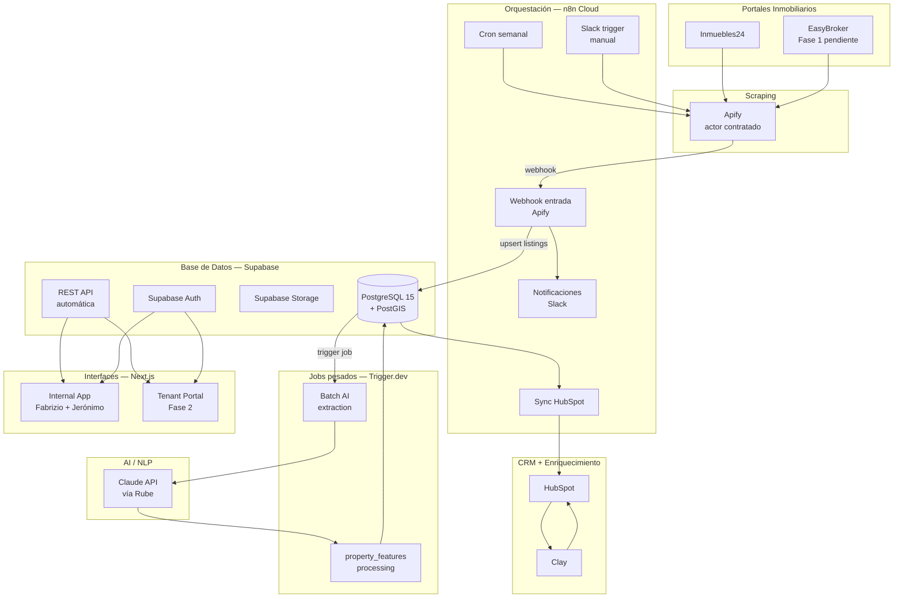
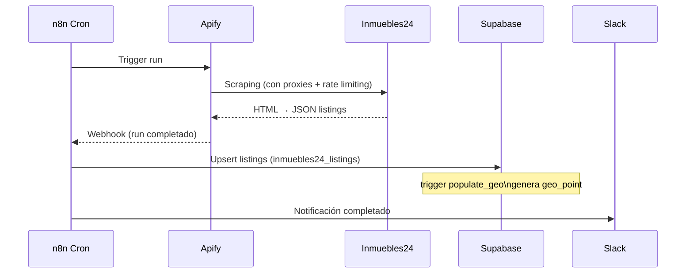
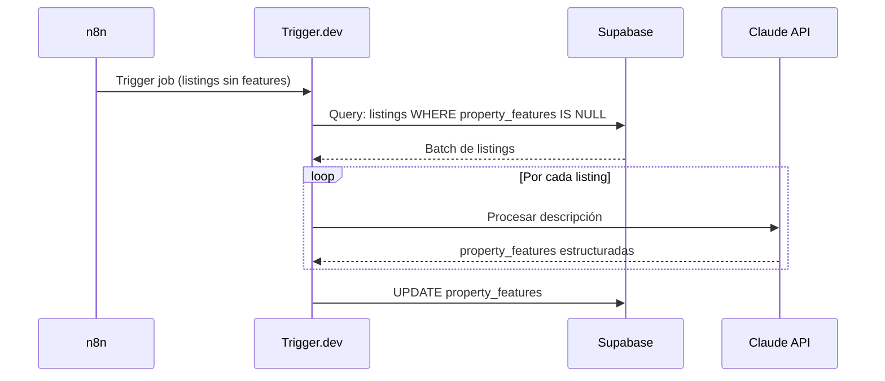
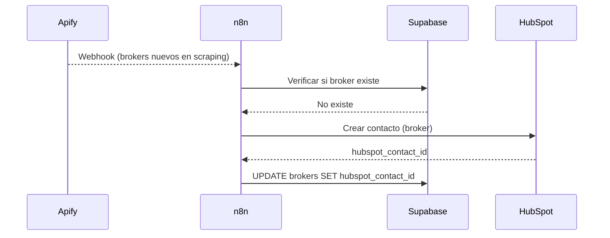

# Arquitectura del Sistema — BEIQA Platform

> **Estado**: ✅ Stack decidido e implementado | **Actualizado**: 2026-02-24
>
> Para el detalle de cada decisión técnica: [Stack-Decidido.md](./Stack-Decidido.md)
> Para el mapa de integraciones y flujos: [Integraciones.md](./Integraciones.md)

---

## Diagrama de arquitectura (stack real)

---

## Componentes del sistema

### Capa de scraping

#### Apify
- **Responsabilidad**: Extracción de propiedades de portales inmobiliarios
- **Implementación**: Actor contratado por portal (Inmuebles24 activo, EasyBroker pendiente)
- **Ventaja**: Maneja rate limiting, proxies, anti-bot internamente
- **Output**: JSON con datos del listing → webhook a n8n

---

### Capa de orquestación (n8n Cloud)

n8n es el orquestador central para todo lo que es integración visual y scheduling.

- **Cron semanal**: dispara Apify automáticamente
- **Webhook de Apify**: recibe datos del scraping, hace upsert en Supabase
- **Slack trigger**: Jerónimo u otros pueden disparar scraping manual desde Slack
- **Sync HubSpot**: cuando entra un broker nuevo, lo crea/actualiza en HubSpot
- **Notificaciones**: alertas a Slack cuando hay errores o ejecuciones completas
- **Disparar Trigger.dev**: cuando hay listings sin `property_features`, inicia el job

---

### Base de datos (Supabase)

- **Motor**: PostgreSQL 15 + PostGIS (extensión habilitada)
- **Auth**: Supabase Auth (JWT, sin Auth0)
- **Storage**: Supabase Storage (imágenes, documentos)
- **API**: REST automática generada desde el schema
- **RLS**: Row Level Security configurado
- **14 migrations** activas al 24 feb 2026
- **~60,000 propiedades** en `inmuebles24_listings`

Ver schema: [Database/Schema-Real.md](./Database/Schema-Real.md)

---

### Jobs pesados (Trigger.dev)

Trigger.dev maneja todo lo que requiere código TypeScript complejo o procesamiento en batch.

- **Batch AI extraction**: toma listings sin `property_features`, los procesa con Claude API en lotes
- **property_features processing**: extrae características estructuradas de las descripciones de propiedades
- **Futuro**: procesamiento de transcripts de llamadas (CircleBack → Trigger.dev → Supabase)

**Regla**: Si el flujo necesita TypeScript real + AI en batch → Trigger.dev. Si es integración visual → n8n.

---

### AI / NLP (Claude API)

- **Proveedor**: Anthropic Claude API, accedida vía Rube (proxy ~3x más barato)
- **Uso actual**: Extracción de features de descripciones de propiedades
- **Uso futuro**: Matching de propiedades, NLP en búsquedas, procesamiento de transcripts
- **Razón sobre OpenAI**: mejor calidad en español, costo ~3x menor

---

### CRM y Data Enrichment

- **HubSpot**: CRM para clientes (tenants), deals y pipeline comercial. Source of truth para comunicaciones.
- **Clay**: enriquece datos de brokers y empresas (LinkedIn, web, teléfono). Los datos enriquecidos van a HubSpot.
- **Sincronización**: Supabase → HubSpot (one-way para propiedades/brokers). HubSpot → Supabase (deal status, minimal).

---

### Frontend (Next.js)

- **Internal App**: Para el equipo de Beiqa (Fabrizio, Jerónimo). Lista de propiedades, mapa, filtros, shortlists.
- **Tenant Portal**: Para clientes de Beiqa. Shortlists, feedback, mapa de opciones. (Fase 2)
- **Owner**: Pamela (frontend developer asignada)
- **Auth**: Supabase Auth (JWT)

---

## Flujos de datos principales

### Flujo 1: Scraping automático semanal

### Flujo 2: Batch AI extraction

### Flujo 3: Sync HubSpot

---

## Decisiones de arquitectura diferidas

| Decisión | Cuándo reconsiderar |
|---------|-------------------|
| Separar DB operativa / analítica (read replica) | Cuando jobs de Trigger.dev compitan con búsquedas operativas |
| Redis cache | Cuando el volumen justifique cache |
| CI/CD (GitHub Actions) | Cuando Next.js esté en desarrollo activo |
| CircleBack para procesamiento de llamadas | Fase 3 |

---

## Lo que NO existe (y no se necesita)

| Componente original | Realidad |
|--------------------|---------|
| Python / Scrapy | Reemplazado por Apify |
| FastAPI / Express | Reemplazado por Supabase REST automático |
| GraphQL API | No necesario con Supabase REST |
| Redis cache | No necesario con el volumen actual |
| Auth0 / Clerk | Reemplazado por Supabase Auth |
| AWS S3 / Cloudflare R2 | Reemplazado por Supabase Storage |
| Sentry / Datadog | Reemplazado por Slack + n8n logs + `error_logs` table |
| LangChain / OpenAI | Reemplazado por Claude API directo vía Rube |

---

*Documento actualizado: 2026-02-24*
*El diagrama original de discovery (con Redis, GraphQL, FastAPI) está archivado*
