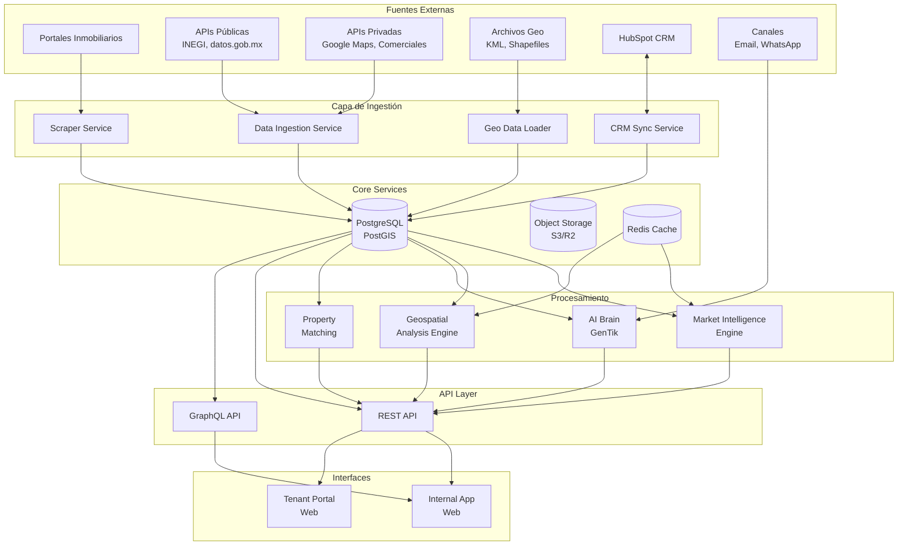
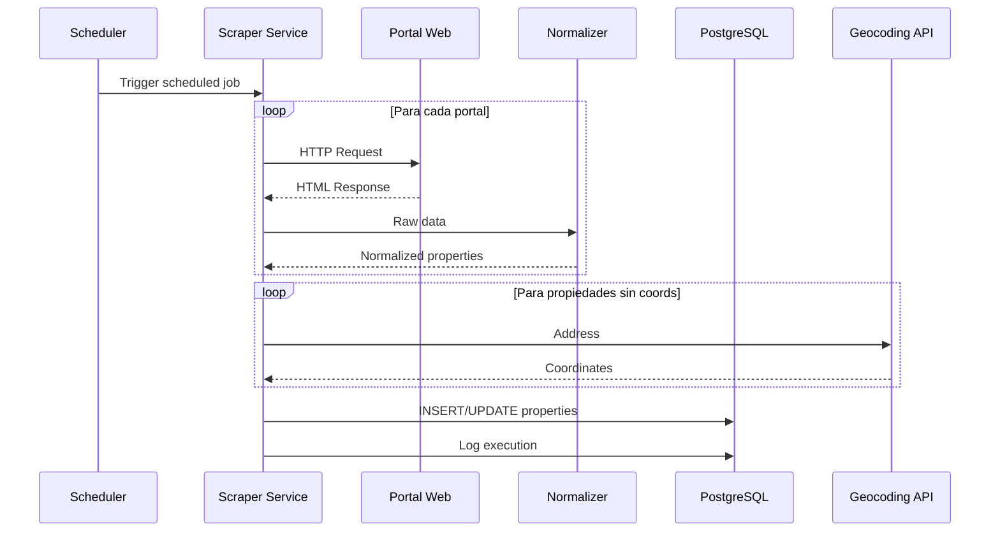
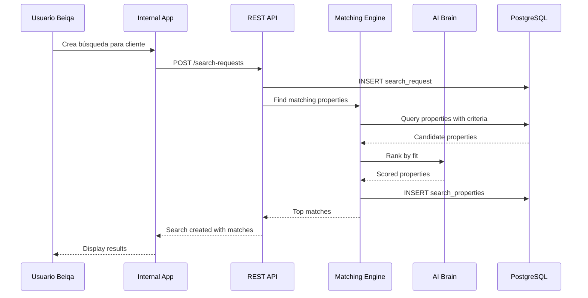
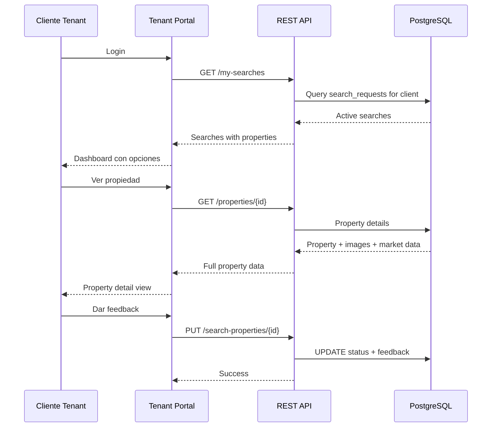

# Arquitectura del Sistema - BEIQA Platform

## Objetivo

Documentar la arquitectura de alto nivel de la plataforma BEIQA.

**Estado**: 🟡 En diseño (borrador)

---

## Diagrama de Arquitectura

---

## Componentes Principales

### 1. Capa de Ingestión

#### Scraper Service
- **Responsabilidad**: Extracción de propiedades de portales
- **Tecnología**: Python (Scrapy o Playwright)
- **Frecuencia**: Diaria/semanal
- **Output**: Propiedades normalizadas a BD

#### Data Ingestion Service
- **Responsabilidad**: Consumo de APIs externas estructuradas
- **Tecnología**: Python o Node.js
- **Fuentes**: INEGI, Google APIs, proveedores comerciales
- **Output**: Datos normalizados a BD

#### Geo Data Loader
- **Responsabilidad**: Carga de archivos geoespaciales
- **Tecnología**: Python (geopandas, fiona)
- **Formatos**: KML, Shapefiles, GeoJSON
- **Output**: Geometrías a PostGIS

#### CRM Sync Service
- **Responsabilidad**: Sincronización bidireccional con HubSpot
- **Tecnología**: Node.js con HubSpot SDK
- **Output**: Clientes y deals sincronizados

---

### 2. Core Services

#### Base de Datos Central
- **Tecnología**: PostgreSQL 15+ con PostGIS
- **Contenido**: 
  - Propiedades
  - Clientes
  - Búsquedas
  - Comunicaciones
  - Geometrías
  - Indicadores de mercado

#### Object Storage
- **Tecnología**: AWS S3, GCP Cloud Storage, o Cloudflare R2
- **Contenido**:
  - Imágenes de propiedades
  - Documentos
  - Reportes generados
  - Archivos geoespaciales originales

#### Cache Layer
- **Tecnología**: Redis
- **Uso**:
  - Resultados de queries frecuentes
  - Sesiones de usuario
  - Rate limiting

---

### 3. Procesamiento

#### Market Intelligence Engine
- **Responsabilidad**: Cálculos de inteligencia de mercado
- **Funciones**:
  - Cálculo de precios promedio por zona/tipo
  - Tendencias de precios
  - Tasas de vacancia
  - Análisis de oferta/demanda
- **Output**: KPIs y métricas almacenadas

#### Geospatial Analysis Engine
- **Responsabilidad**: Análisis espaciales
- **Funciones**:
  - Búsqueda por radio/polígono
  - Análisis de proximidad (POIs)
  - Cálculo de distancias
  - Overlay de capas
- **Tecnología**: PostGIS queries, Python (shapely)

#### AI Brain (GenTik)
- **Responsabilidad**: Procesamiento inteligente
- **Funciones**:
  - Matching propiedad-cliente
  - Interpretación de solicitudes NLP
  - Resumen de comunicaciones
  - Recomendaciones proactivas
- **Tecnología**: OpenAI API, LangChain

#### Property Matching
- **Responsabilidad**: Encontrar propiedades para búsquedas
- **Algoritmo**: Score basado en criterios + AI
- **Output**: Propiedades rankeadas por match

---

### 4. API Layer

#### REST API
- **Tecnología**: FastAPI (Python) o Express (Node.js)
- **Endpoints**:
  - CRUD de propiedades, clientes, búsquedas
  - Búsquedas avanzadas
  - Triggers de scraping
  - Reports

#### GraphQL API (Opcional)
- **Tecnología**: Apollo Server o Strawberry
- **Uso**: Queries flexibles para frontend
- **Ventaja**: Menos overfetching

---

### 5. Interfaces

#### Internal App (Web)
- **Usuarios**: Equipo interno de Beiqa
- **Tecnología**: React/Next.js + TypeScript
- **Funciones**:
  - Dashboard de propiedades
  - Gestión de clientes
  - Mapas interactivos
  - Reportes de inteligencia
  - Administración de scraper

#### Tenant Portal (Web)
- **Usuarios**: Clientes de Beiqa
- **Tecnología**: React/Next.js + TypeScript
- **Funciones**:
  - Ver propiedades shortlisted
  - Mapa de opciones
  - Comparativos
  - Reportes personalizados
  - Feedback y comunicación

---

## Decisiones de Arquitectura Pendientes (ADRs)

| ID | Decisión | Opciones | Estado |
|----|----------|----------|--------|
| ADR-001 | Lenguaje backend principal | Python vs Node.js | 🔴 Por decidir |
| ADR-002 | Framework web | FastAPI vs Express vs NestJS | 🔴 Por decidir |
| ADR-003 | Framework frontend | Next.js vs Remix | 🔴 Por decidir |
| ADR-004 | Cloud provider | AWS vs GCP vs Azure | 🔴 Por decidir |
| ADR-005 | Hosting DB | Managed vs Self-hosted | 🔴 Por decidir |
| ADR-006 | CI/CD | GitHub Actions vs GitLab CI | 🔴 Por decidir |

---

## Flujos de Datos Principales

### Flujo 1: Scraping de Propiedades

### Flujo 2: Búsqueda de Cliente

### Flujo 3: Portal de Tenant

---

## Consideraciones de Seguridad

### Autenticación
- Internal App: Auth0 o similar (SSO)
- Tenant Portal: Magic link o password
- APIs: JWT tokens

### Autorización
- RBAC para usuarios internos
- Tenant solo ve sus búsquedas/propiedades

### Datos sensibles
- No almacenar datos personales de terceros (contactos de listings)
- Encriptar datos de clientes en reposo
- HTTPS en todos los endpoints

---

## Próximos Pasos

1. [ ] Tomar decisiones de ADRs pendientes
2. [ ] Diseñar API contracts detallados
3. [ ] Crear diagrama de deployment
4. [ ] Definir estrategia de testing
5. [ ] Estimar infraestructura necesaria
