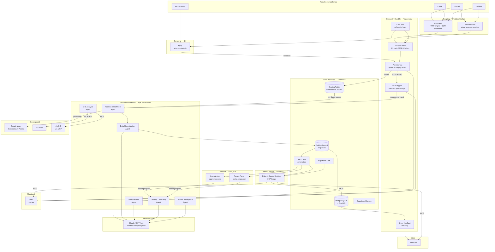
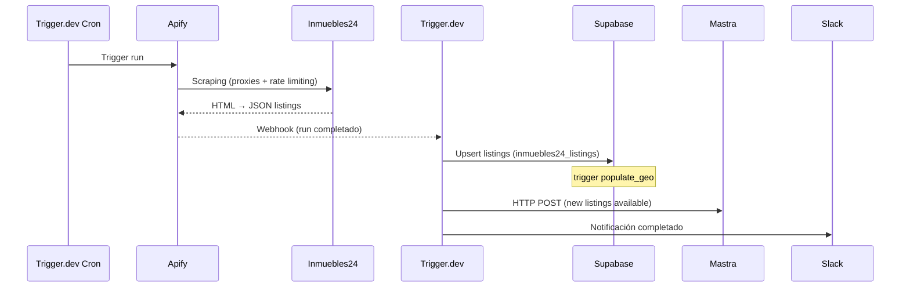
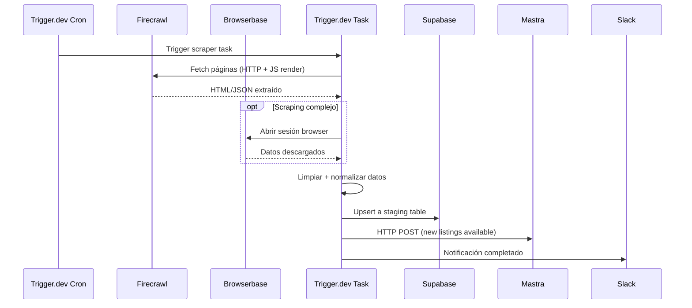
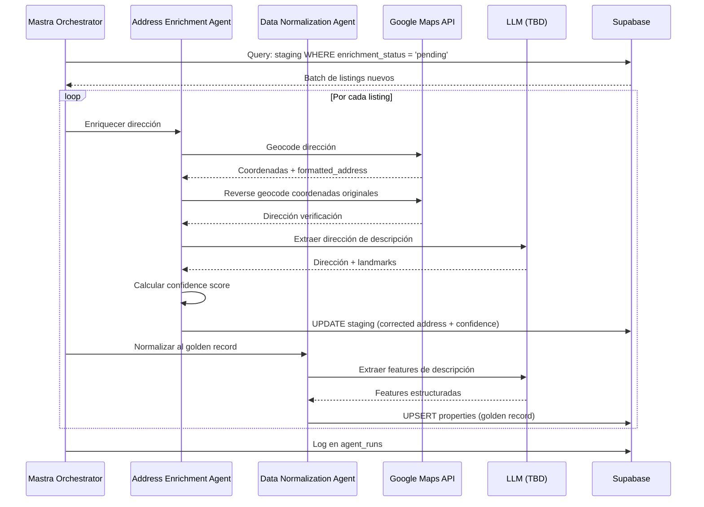
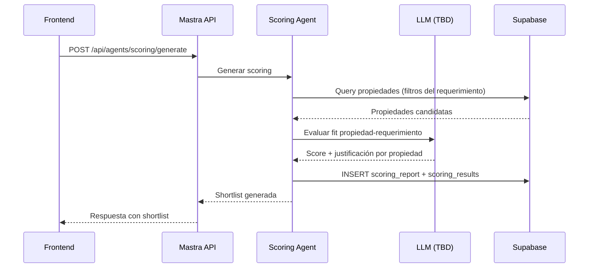
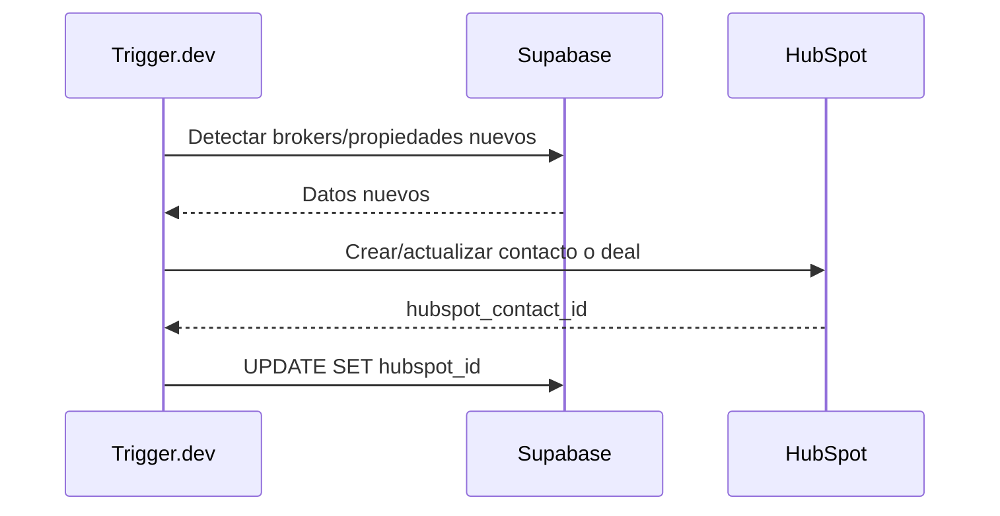

# Arquitectura del Sistema — BEIQA Platform

> **Estado**: ✅ Stack decidido e implementado | **Actualizado**: 2026-03-05
>
> Para el detalle de cada decisión técnica: [Stack-Decidido.md](./Stack-Decidido.md)
> Para cada ADR individual: [ADRs/README.md](ADRs/README.md)
> Para la arquitectura de agentes AI: [Agent-Architecture.md](./Agent-Architecture.md)

---

## Diagrama de arquitectura (stack real — marzo 2026)

---

## Componentes del sistema

### Capa de scraping

#### Inmuebles24 — Apify
- **ADR**: [ADR-002](ADRs/ADR-002-Estrategia-Scraping.md)
- **Responsabilidad**: Extracción de propiedades de Inmuebles24
- **Implementación**: Actor contratado, maneja rate limiting, proxies, anti-bot internamente
- **Output**: JSON con datos del listing → webhook a Trigger.dev

#### Pincali, CBRE, Colliers — Firecrawl + Browserbase
- **ADRs**: [ADR-007](ADRs/ADR-007-Firecrawl.md), [ADR-008](ADRs/ADR-008-Browserbase.md)
- **Firecrawl** ($99/mo): Motor HTTP con JS rendering, LLM extraction, stealth proxy
- **Browserbase** ($20/mo): Cloud browser para Colliers (downloads) y Pincali (broker contact)
- **Código**: Trigger.dev tasks en repo `beiqa-scraper`

---

### Ejecución Durable (Trigger.dev)

- **ADR**: [ADR-003](ADRs/ADR-003-Trigger-dev.md)
- **Repo**: `github.com/pablo-beiqa/beiqa-scraper`
- **Scope**: Scrapers custom, persistencia a Supabase staging tables, sync HubSpot, cron jobs, HTTP trigger a Mastra post-scrape
- **NO es**: el backend, ni el motor de AI/NLP (→ Mastra), ni el "cerebro" del sistema

**Tasks activos**:
| Task | Función |
|------|---------|
| `pincali-scraper` | Scraping de Pincali via Firecrawl |
| `cbre-scraper` | Scraping de CBRE via Firecrawl |
| `colliers-scraper` | Scraping de Colliers via Firecrawl + Browserbase |
| `persist-to-supabase` | Upsert de datos scrapeados a staging tables |
| `sync-hubspot` | Sync one-way Supabase → HubSpot (en migración) |
| `trigger-mastra` | HTTP POST a Mastra post-scrape (por implementar) |

> **Nota**: `batch-ai-extraction` migra a Mastra como Address Enrichment + Data Normalization Agents. Ver [ADR-020](ADRs/ADR-020-Mastra.md).

---

### AI Brain — Mastra (Capa Transversal)

- **ADR**: [ADR-020](ADRs/ADR-020-Mastra.md)
- **Separación de responsabilidades**: [ADR-021](ADRs/ADR-021-Separacion-Trigger-Mastra.md)
- **Repo**: `github.com/pablo-beiqa/beiqa-agents`
- **Framework**: [Mastra](https://mastra.ai) (TypeScript, open source, Apache 2.0)
- **Scope**: Orquestación de agentes AI — enrichment, normalization, deduplication, scoring, market intelligence, GIS analysis
- **Comunicación**: HTTP API (Hono server) + Supabase shared DB + MCP clients (ArcGIS, etc.)

**Agentes**:
| Agente | Prioridad | Módulo que sirve |
|--------|-----------|-----------------|
| Address Enrichment | P0 | Data, Geospatial |
| Data Normalization | P0 | Data |
| Deduplication | P1 | Data |
| Scoring / Matching | P1 | Internal App, Tenant Portal |
| Market Intelligence | P2 | Market Intelligence |
| GIS Analysis | P2 | Geospatial |

Ver arquitectura completa de agentes: [Agent-Architecture.md](./Agent-Architecture.md)

---

### Base de datos (Supabase)

- **ADR**: [ADR-001](ADRs/ADR-001-Supabase-Plataforma.md)
- **Motor**: PostgreSQL 15 + PostGIS
- **Auth**: Supabase Auth (JWT, sin Auth0)
- **Storage**: Supabase Storage (imágenes, documentos)
- **API**: REST automática generada desde el schema
- **RLS**: Row Level Security configurado
- **14 migrations** activas
- **~60,000 propiedades** en `inmuebles24_listings`

**Estructura de datos** ([ADR-012](ADRs/ADR-012-Multi-Portal-Data.md)):
- **Staging tables**: `inmuebles24_listings`, `pincali_listings`, `cbre_listings`, `colliers_listings` — datos crudos por portal
- **Golden record**: `properties` — datos normalizados, deduplicados, enriquecidos por Mastra
- **Source of truth**: Supabase es source of truth para propiedades, listings, brokers, analytics, geo data

Ver schema: [Database/Schema-Real.md](./Database/Schema-Real.md)

---

### Frontend (Next.js 15)

- **ADR**: [ADR-015](ADRs/ADR-015-Frontend-Next-js.md)
- **Repo**: `github.com/pablo-beiqa/beiqa-frontend`
- **Internal App** (`app.beiqa.com`): Dashboard del equipo — gestión de propiedades, shortlists, analytics
- **Tenant Portal** (`portal.beiqa.com`): Portal de clientes — scoring, shortlists compartidas, feedback
- **Consume**: Supabase REST API (golden record) + Mastra API (scoring on-demand)
- **Estado**: Phase 0 completo, en desarrollo

---

### Interfaz actual (Rube + Claude Desktop)

- **ADR**: [ADR-004](ADRs/ADR-004-Rube-MCP-Bridge.md)
- **Función**: Bridge MCP que conecta Claude Desktop con Supabase, HubSpot, Slack
- **Scope**: SOLO interacción humana. Los pipelines automáticos van por Trigger.dev y Mastra.
- **Transitorio**: Se reemplazará progresivamente por Internal App + Tenant Portal

---

### CRM y Data Enrichment

- **ADR**: [ADR-005](ADRs/ADR-005-HubSpot-CRM.md)
- **HubSpot**: CRM para clientes (tenants), deals y pipeline comercial
- **Sincronización**: Supabase → HubSpot (one-way vía Trigger.dev, determinístico). HubSpot → Supabase (deal status, minimal).

---

### Geoespacial

- **H3 Indexing** ([ADR-009](ADRs/ADR-009-H3-Indexing.md)): Sistema hexagonal, capas 5-11 — calculado por GIS Agent post-enrichment
- **AGEB/INEGI** ([ADR-010](ADRs/ADR-010-AGEB-INEGI.md)): Polígonos censales — asignados por GIS Agent via PostGIS spatial join
- **Google Maps** ([ADR-011](ADRs/ADR-011-Google-Maps-Platform.md)): Geocoding + Places API — usado como tool del Address Enrichment Agent
- **ArcGIS**: Análisis geoespacial avanzado — consumido vía MCP server por GIS Agent
- **PostGIS**: Trigger `populate_geo` operando, índices GIST activos

---

## Flujos de datos principales

### Flujo 1: Scraping Inmuebles24 (Apify)

### Flujo 2: Scraping portales custom (Firecrawl + Trigger.dev)

### Flujo 3: Enrichment Pipeline (Mastra)

### Flujo 4: Scoring on-demand (Mastra)

### Flujo 5: Sync HubSpot (one-way, Trigger.dev)

---

## Lo que NO existe (y no se necesita hoy)

| Componente eliminado | Reemplazado por |
|--------------------|----------------|
| n8n Cloud | Trigger.dev ([ADR-019](ADRs/ADR-019-n8n-Deprecado.md)) |
| Backboard.io | Mastra memory ([ADR-020](ADRs/ADR-020-Mastra.md), supersede [ADR-014](ADRs/ADR-014-Backboard.md)) |
| Python / Scrapy | Apify + Firecrawl |
| FastAPI / Express | Supabase REST automático |
| GraphQL API | REST auto-generado |
| Redis cache | No necesario con volumen actual |
| Auth0 / Clerk | Supabase Auth |
| AWS S3 / Cloudflare R2 | Supabase Storage |
| Sentry / Datadog | Slack + `error_logs` table |
| EasyBroker | Descartado ([ADR-002](ADRs/ADR-002-Estrategia-Scraping.md)) |

---

*Documento actualizado: 2026-03-05 | Versión anterior archivada en [archive/](archive/)*
