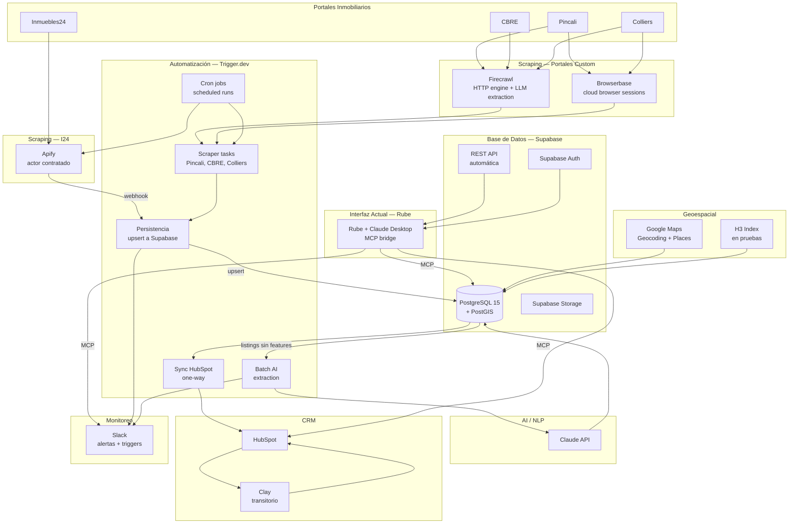
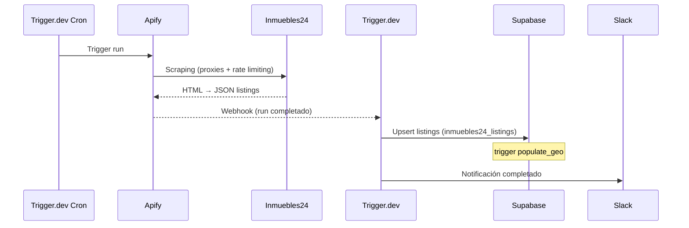
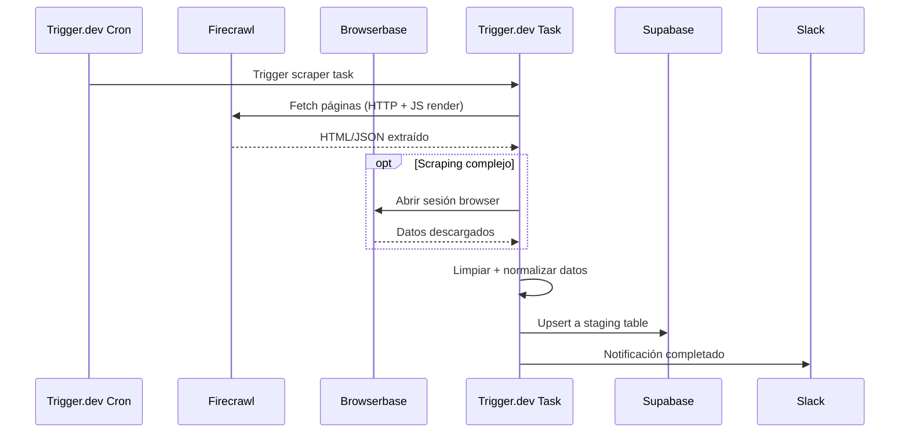
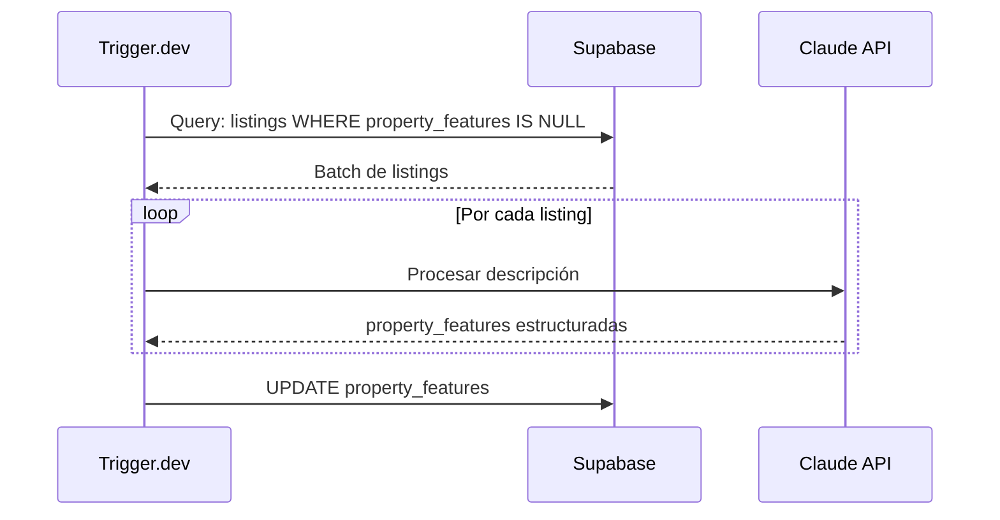
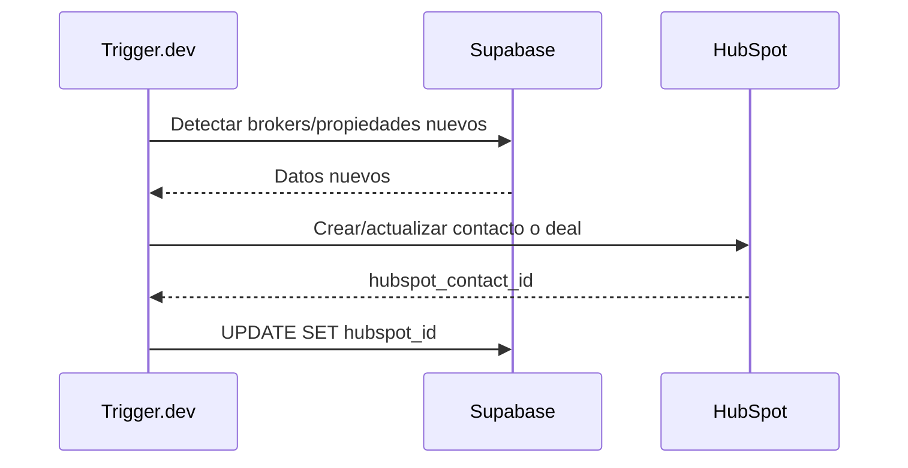

# Arquitectura del Sistema — BEIQA Platform (Estado Actual)

> **Estado**: ✅ Stack decidido e implementado | **Actualizado**: 2026-02-27
>
> Para el detalle de cada decisión técnica: [Stack-Decidido.md](./Stack-Decidido.md)
> Para cada ADR individual: [ADRs/README.md](ADRs/README.md)

---

## Diagrama de arquitectura (stack real — febrero 2026)

---

## Componentes del sistema

### Capa de scraping

#### Inmuebles24 — Apify
- **ADR**: [ADR-002](ADRs/ADR-002-Estrategia-Scraping.md)
- **Responsabilidad**: Extracción de propiedades de Inmuebles24
- **Implementación**: Actor contratado, maneja rate limiting, proxies, anti-bot internamente
- **Output**: JSON con datos del listing → webhook a Trigger.dev

#### Pincali, CBRE, Colliers — Firecrawl + Browserbase
- **ADRs**: [ADR-007](ADRs/ADR-007-Firecrawl.md), [ADR-008](ADRs/ADR-008-Browserbase.md)
- **Firecrawl** ($99/mo): Motor HTTP con JS rendering, LLM extraction, stealth proxy
- **Browserbase** ($20/mo): Cloud browser para Colliers (downloads) y Pincali (broker contact)
- **Código**: Trigger.dev tasks en repo `beiqa-scraper`

---

### Automatización (Trigger.dev)

- **ADR**: [ADR-003](ADRs/ADR-003-Trigger-dev.md)
- **Repo**: `github.com/pablo-beiqa/beiqa-scraper`
- **Scope**: Scrapers custom, limpieza de datos, persistencia a Supabase, sync HubSpot, cron jobs, batch AI extraction
- **NO es**: el backend, ni la base de datos, ni el "cerebro" del sistema

**Tasks activos**:
| Task | Función |
|------|---------|
| `pincali-scraper` | Scraping de Pincali via Firecrawl |
| `cbre-scraper` | Scraping de CBRE via Firecrawl |
| `colliers-scraper` | Scraping de Colliers via Firecrawl + Browserbase |
| `persist-to-supabase` | Upsert de datos scrapeados a staging tables |
| `batch-ai-extraction` | Extracción de features con Claude API |
| `sync-hubspot` | Sync one-way Supabase → HubSpot (en migración) |

---

### Base de datos (Supabase)

- **ADR**: [ADR-001](ADRs/ADR-001-Supabase-Plataforma.md)
- **Motor**: PostgreSQL 15 + PostGIS
- **Auth**: Supabase Auth (JWT, sin Auth0)
- **Storage**: Supabase Storage (imágenes, documentos)
- **API**: REST automática generada desde el schema
- **RLS**: Row Level Security configurado
- **14 migrations** activas
- **~60,000 propiedades** en `inmuebles24_listings`

Ver schema: [Database/Schema-Real.md](./Database/Schema-Real.md)

---

### Interfaz actual (Rube + Claude Desktop)

- **ADR**: [ADR-004](ADRs/ADR-004-Rube-MCP-Bridge.md)
- **Función**: Bridge MCP que conecta Claude Desktop con Supabase, HubSpot, Slack
- **Scope**: SOLO interacción humana. Los pipelines automáticos van por Trigger.dev.
- **Transitorio**: Se reemplazará por Internal App (Next.js) en Fase 2-3

---

### AI / NLP (Claude API)

- **Acceso**: Claude API, accedida vía Rube (para interacción humana) y Trigger.dev (para batch)
- **Uso actual**: Extracción de features de descripciones de propiedades (batch)
- **Uso futuro**: Matching de propiedades, NLP en búsquedas, procesamiento de transcripts
- **Razón sobre OpenAI**: mejor calidad en español

---

### CRM y Data Enrichment

- **ADR**: [ADR-005](ADRs/ADR-005-HubSpot-CRM.md)
- **HubSpot**: CRM para clientes (tenants), deals y pipeline comercial
- **Clay** (transitorio): Enriquece datos de brokers y empresas → sale pronto, lógica migra a Trigger.dev
- **Sincronización**: Supabase → HubSpot (one-way vía Trigger.dev). HubSpot → Supabase (deal status, minimal).

---

### Geoespacial

- **H3 Indexing** ([ADR-009](ADRs/ADR-009-H3-Indexing.md)): Sistema hexagonal, capas 5-11, en pruebas (Fabrizio)
- **AGEB/INEGI** ([ADR-010](ADRs/ADR-010-AGEB-INEGI.md)): Polígonos censales, decidido, por implementar
- **Google Maps** ([ADR-011](ADRs/ADR-011-Google-Maps-Platform.md)): Geocoding + Places API activas
- **PostGIS**: Trigger `populate_geo` operando, índices GIST activos

---

## Flujos de datos principales

### Flujo 1: Scraping Inmuebles24 (Apify)

### Flujo 2: Scraping portales custom (Firecrawl + Trigger.dev)

### Flujo 3: Batch AI extraction

### Flujo 4: Sync HubSpot (one-way)

---

## Lo que NO existe (y no se necesita hoy)

| Componente eliminado | Reemplazado por |
|--------------------|----------------|
| n8n Cloud | Trigger.dev ([ADR-019](ADRs/ADR-019-n8n-Deprecado.md)) |
| Python / Scrapy | Apify + Firecrawl |
| FastAPI / Express | Supabase REST automático |
| GraphQL API | REST auto-generado |
| Redis cache | No necesario con volumen actual |
| Auth0 / Clerk | Supabase Auth |
| AWS S3 / Cloudflare R2 | Supabase Storage |
| Sentry / Datadog | Slack + `error_logs` table |
| EasyBroker | Descartado ([ADR-002](ADRs/ADR-002-Estrategia-Scraping.md)) |

---

*Documento actualizado: 2026-02-27 | Versión anterior archivada en [archive/](archive/)*
