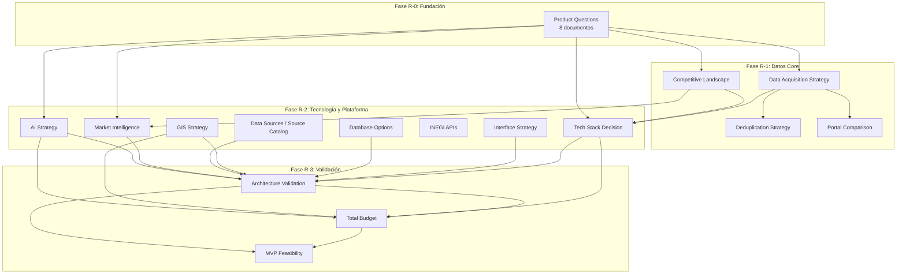

# 02-Research -- Mapa de Investigación BEIQA

## Navegación Rápida

Este documento es el **hub central** de toda la investigación del proyecto BEIQA. Funciona como un grafo de conocimiento: cada documento está referenciado, con dependencias claras y estado actual.

---

## Estado General

| Fase | Nombre | Estado | Documentos |
|------|--------|--------|------------|
| R-0 | Fundación | 🔴 Sin iniciar | README, Research-Overview, 9 Product Questions |
| R-1 | Datos Core | 🔴 Sin iniciar | Competitive Landscape, Data Acquisition, Deduplication, Portal Comparison |
| R-2 | Tecnología y Plataforma | 🔴 Sin iniciar | Tech Stack, Interface, DB, GIS, Data Sources, INEGI, Market Intel, AI |
| R-3 | Validación y Factibilidad | 🔴 Sin iniciar | Architecture Validation, Budget, Feasibility |

---

## Diagrama de Dependencias

---

## Documentos por Fase

### Fase R-0: Fundación

Cuestionarios de visión de producto. Preguntas puras en español, sin respuestas. Pablo y stakeholders los responden antes de cualquier investigación técnica.

| Documento | Estado | Descripción |
|-----------|--------|-------------|
| [Research-Overview.md](./Research-Overview.md) | 🔴 | Metodología, fases, tracker de estado |
| [Product-Questions-Vision-General.md](../00-Overview/Product-Questions-Vision-General.md) | 🔴 | Visión general del producto |
| [Product-Questions-Scraper.md](./Scraper-Research/Product-Questions-Scraper.md) | 🔴 | Adquisición de datos de propiedades |
| [Product-Questions-Ingestion.md](./Data-Sources-Research/Product-Questions-Ingestion.md) | 🔴 | Ingestión de datos externos estructurados |
| [Product-Questions-Base-de-Datos.md](./Technology-Research/Product-Questions-Base-de-Datos.md) | 🔴 | Estructura de la base de datos |
| [Product-Questions Inteligencia de Mercado](./Market-Intelligence/Product-Questions.md) | 🔴 | Inteligencia de mercado |
| [Product-Questions-Geoespacial.md](./Data-Sources-Research/Product-Questions-Geoespacial.md) | 🔴 | Mapas, polígonos, GIS |
| [Product-Questions IA](./AI-Strategy/Product-Questions.md) | 🔴 | Capacidades de IA |
| [Product-Questions Portal Tenants](./Tenant-Portal/Product-Questions.md) | 🔴 | Portal para clientes |
| [Product-Questions-Interfaz.md](./Technology-Research/Product-Questions-Interfaz.md) | 🔴 | Cómo interactúa el equipo interno (dashboard vs IA vs híbrido) |

### Fase R-1: Datos Core

Cómo entran los datos al sistema, cómo se manejan duplicados, y qué existe en el mercado.

| Documento | Estado | Descripción |
|-----------|--------|-------------|
| [Competitive-Landscape.md](./Competitive-Landscape.md) | 🔴 | Panorama proptech México/LatAm |
| [Data-Acquisition-Strategy.md](./Data-Acquisition/Data-Acquisition-Strategy.md) | 🔴 | Métodos de adquisición de datos (incluye EasyBroker) |
| [Deduplication-Strategy.md](./Data-Acquisition/Deduplication-Strategy.md) | 🔴 | Fuzzy matching, deduplicación con IA |
| [Portal-Comparison.md](./Scraper-Research/Portal-Comparison.md) | 🔴 | Comparativo de portales (reestructurado) |

### Fase R-2: Tecnología y Plataforma

Decisiones de stack + las capas que dan valor a los datos. Pueden ejecutarse en paralelo.

| Documento | Estado | Descripción |
|-----------|--------|-------------|
| [Tech-Stack-Decision.md](./Technology-Research/Tech-Stack-Decision.md) | 🔴 | Framework de decisión para 6 ADRs |
| [Interface-Strategy.md](./Technology-Research/Interface-Strategy.md) | 🔴 | Dashboard vs IA vs low-code vs híbrido |
| [Database-Options.md](./Technology-Research/Database-Options.md) | 🔴 | Opciones de hosting (PostgreSQL+PostGIS decidido) |
| [Google-Maps-Platform.md](./Data-Sources-Research/Google-Maps-Platform.md) | 🔴 | Estrategia GIS completa (expandido) |
| [Source-Catalog.md](./Data-Sources-Research/Source-Catalog.md) | 🔴 | Catálogo de fuentes con preguntas de investigación |
| [INEGI-APIs.md](./Data-Sources-Research/INEGI-APIs.md) | 🔴 | Investigación INEGI (estructura expandida) |
| [Market-Intelligence-Strategy.md](./Market-Intelligence/Market-Intelligence-Strategy.md) | 🔴 | Sistematizar inteligencia de mercado |
| [AI-Strategy.md](./AI-Strategy/AI-Strategy.md) | 🔴 | Puntos de integración IA/LLM |

### Fase R-3: Validación y Factibilidad

Validar arquitectura contra hallazgos, producir costos reales.

| Documento | Estado | Descripción |
|-----------|--------|-------------|
| [Architecture-Validation.md](./Architecture-Validation.md) | 🔴 | Revisión componente por componente |
| [Total-Budget.md](./Cost-Estimates/Total-Budget.md) | 🔴 | Presupuesto con números reales |
| [MVP-Feasibility.md](./Feasibility/MVP-Feasibility.md) | 🔴 | Decisión GO/NO-GO |

---

## Referencias Cruzadas al Resto del Repositorio

### Documentos Fundacionales (Contexto ya capturado)

| Documento | Relevancia |
|-----------|------------|
| [00-Overview/Vision-and-Goals.md](../00-Overview/Vision-and-Goals.md) | Visión del producto, objetivos medibles, usuarios |
| [00-Overview/Glossary.md](../00-Overview/Glossary.md) | Definiciones de términos clave |
| [00-Overview/Stakeholders.md](../00-Overview/Stakeholders.md) | Quién decide, quién usa, RACI |
| [00-Overview/Success-Metrics.md](../00-Overview/Success-Metrics.md) | KPIs de éxito |
| [01-Discovery/Business-Context.md](../01-Discovery/Business-Context.md) | Modelo de negocio, flujo de proyectos |
| [01-Discovery/Current-Process.md](../01-Discovery/Current-Process.md) | Proceso manual actual |
| [01-Discovery/Pain-Points.md](../01-Discovery/Pain-Points.md) | Problemas que resuelve BEIQA |

### Documentos Técnicos (A validar con la investigación)

| Documento | Relevancia |
|-----------|------------|
| [03-Requirements/Functional-Requirements/01-Scraper.md](../03-Requirements/Functional-Requirements/01-Scraper.md) | Requerimientos del scraper |
| [03-Requirements/Data-Requirements/Data-Model.md](../03-Requirements/Data-Requirements/Data-Model.md) | Modelo de datos propuesto |
| [04-Architecture/System-Architecture.md](../04-Architecture/System-Architecture.md) | Arquitectura propuesta (VISION -- requiere validación) |
| [06-Roadmap/Phase-0-Investigation.md](../06-Roadmap/Phase-0-Investigation.md) | Fase de investigación del roadmap |

---

## Archivos Referenciados que No Existen (Consolidados o Diferidos)

Estos archivos aparecen en documentos existentes pero nunca fueron creados:

| Archivo Referenciado | Resolución |
|---------------------|------------|
| `datos-gob-mx.md` | Consolidado en `Source-Catalog.md` expandido |
| `Catastro-Access.md` | Consolidado en `Source-Catalog.md` expandido |
| `Commercial-Data-Providers.md` | Diferido a post-MVP (nota en `Source-Catalog.md`) |
| `Geospatial-Stack.md` | Consolidado en `Google-Maps-Platform.md` expandido (ahora estrategia GIS completa) |

---

## Cómo Usar Este Índice

1. **Empieza por Fase R-0**: Responde los cuestionarios de producto antes de cualquier investigación técnica
2. **Sigue el orden de fases**: R-0 → R-1 → R-2 → R-3 (aunque R-2 tiene paralelismo interno)
3. **Actualiza el estado**: Cambia 🔴 → 🟡 → 🟢 conforme avances
4. **Consulta las dependencias**: El diagrama Mermaid muestra qué documento necesita qué otro
5. **Referencia cruzada**: Cada documento de investigación debe citar qué documentos existentes informaron sus preguntas
