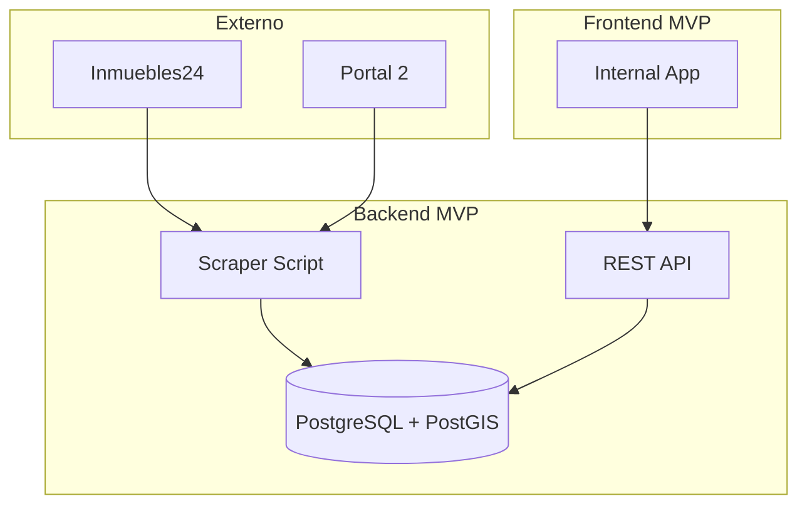

# Fase 1: MVP (Minimum Viable Product)

## Objetivo

Entregar una versión funcional mínima que permita a Beiqa empezar a usar la plataforma para operaciones básicas.

**Duración estimada**: 6-8 semanas (post Fase 0)  
**Estado**: 🔴 Por iniciar

---

## Alcance del MVP

### Incluido en MVP

| Módulo | Funcionalidad |
|--------|---------------|
| **Scraper** | Scraping básico de 2-3 portales principales |
| **Base de datos** | Estructura core de propiedades, clientes, búsquedas |
| **Internal App** | CRUD de propiedades (ver, filtrar, buscar) |
| **Internal App** | Mapa básico con propiedades |
| **Internal App** | Gestión básica de clientes y búsquedas |
| **Internal App** | Shortlists por cliente |

### Excluido del MVP (Fases posteriores)

| Módulo | Funcionalidad | Fase |
|--------|---------------|------|
| Data Ingestion | Integración INEGI, Google APIs | Fase 2 |
| Geospatial | Análisis avanzado, capas, zonas | Fase 2 |
| Market Intelligence | KPIs, tendencias, reportes automáticos | Fase 2 |
| AI Brain | Matching inteligente, NLP | Fase 3 |
| Tenant Portal | Portal web para clientes | Fase 4 |

---

## Funcionalidades MVP Detalladas

### 1. Módulo Scraper (MVP)

| ID | Feature | Descripción | Prioridad |
|----|---------|-------------|-----------|
| SCR-MVP-01 | Scraping Inmuebles24 | Extraer propiedades comerciales/industriales | Alta |
| SCR-MVP-02 | Scraping Portal 2 | Extraer de segundo portal | Alta |
| SCR-MVP-03 | Normalización básica | Unificar formatos de datos | Alta |
| SCR-MVP-04 | Ejecución manual | Trigger desde admin | Alta |
| SCR-MVP-05 | Log de ejecución | Registrar corridas y errores | Media |

### 2. Base de Datos (MVP)

| ID | Feature | Descripción | Prioridad |
|----|---------|-------------|-----------|
| DB-MVP-01 | Tabla propiedades | Estructura core con campos esenciales | Alta |
| DB-MVP-02 | Tabla clientes | Información básica de clientes | Alta |
| DB-MVP-03 | Tabla búsquedas | Solicitudes de búsqueda | Alta |
| DB-MVP-04 | Tabla shortlist | Propiedades por búsqueda | Alta |
| DB-MVP-05 | Índice geoespacial | Para queries de ubicación | Alta |

### 3. Internal App (MVP)

| ID | Feature | Descripción | Prioridad |
|----|---------|-------------|-----------|
| APP-MVP-01 | Login/Auth | Autenticación de usuarios | Alta |
| APP-MVP-02 | Lista propiedades | Ver todas las propiedades | Alta |
| APP-MVP-03 | Filtros básicos | Tipo, precio, superficie, zona | Alta |
| APP-MVP-04 | Detalle propiedad | Ver toda la info de una propiedad | Alta |
| APP-MVP-05 | Mapa básico | Ver propiedades en mapa | Alta |
| APP-MVP-06 | Búsqueda por área | Dibujar zona en mapa | Media |
| APP-MVP-07 | Lista clientes | CRUD de clientes | Alta |
| APP-MVP-08 | Lista búsquedas | CRUD de búsquedas por cliente | Alta |
| APP-MVP-09 | Shortlist | Agregar/quitar propiedades de búsqueda | Alta |
| APP-MVP-10 | Export básico | Exportar shortlist a Excel | Media |

---

## Arquitectura MVP

---

## Plan de Sprints (Estimado)

### Sprint 1 (2 semanas)

| Tarea | Estimación | Notas |
|-------|------------|-------|
| Setup proyecto backend | 2 días | Framework, estructura |
| Setup proyecto frontend | 2 días | Framework, estructura |
| Modelo de datos core | 3 días | Migraciones, seeding |
| API: Auth básico | 2 días | |
| API: CRUD propiedades | 3 días | |

### Sprint 2 (2 semanas)

| Tarea | Estimación | Notas |
|-------|------------|-------|
| Scraper Portal 1 | 4 días | Inmuebles24 |
| Scraper Portal 2 | 3 días | Vivanuncios o similar |
| API: CRUD clientes | 2 días | |
| API: CRUD búsquedas | 2 días | |
| API: Shortlists | 2 días | |

### Sprint 3 (2 semanas)

| Tarea | Estimación | Notas |
|-------|------------|-------|
| Frontend: Lista propiedades | 3 días | Con filtros |
| Frontend: Detalle propiedad | 2 días | |
| Frontend: Mapa básico | 3 días | Con markers |
| Frontend: Búsqueda por área | 2 días | Draw polygon |
| Frontend: Auth | 2 días | |

### Sprint 4 (2 semanas)

| Tarea | Estimación | Notas |
|-------|------------|-------|
| Frontend: Clientes | 2 días | |
| Frontend: Búsquedas | 2 días | |
| Frontend: Shortlists | 2 días | |
| Integración completa | 2 días | |
| Testing & bugfixes | 3 días | |
| Deploy a staging | 1 día | |

---

## Criterios de Aceptación MVP

### Funcionales

- [ ] Puedo ver todas las propiedades scrapeadas
- [ ] Puedo filtrar por tipo, precio, superficie
- [ ] Puedo ver propiedades en un mapa
- [ ] Puedo buscar por área (dibujar en mapa)
- [ ] Puedo crear un cliente
- [ ] Puedo crear una búsqueda para un cliente
- [ ] Puedo agregar propiedades a una shortlist
- [ ] Puedo exportar shortlist a Excel
- [ ] El scraper extrae datos de 2 portales

### No funcionales

- [ ] Carga de lista de propiedades < 3 segundos
- [ ] Mapa carga con < 5 segundos
- [ ] Sistema disponible > 95% del tiempo
- [ ] Datos de scraping actualizados (< 1 semana)

---

## Dependencias y Riesgos

### Dependencias

| Dependencia | Responsable | Estado |
|-------------|-------------|--------|
| Decisiones de Fase 0 completadas | PM | 🔴 |
| Ambiente de desarrollo listo | DevOps | 🔴 |
| Accesos a portales verificados | Dev | 🔴 |
| Diseños UI básicos | PM/UX | 🔴 |

### Riesgos

| Riesgo | Prob | Impacto | Mitigación |
|--------|------|---------|------------|
| Portales cambian estructura | Media | Alto | Monitorear, tener fallback |
| Performance de mapa con muchas props | Media | Medio | Clustering, pagination |
| Alcance crece durante desarrollo | Alta | Medio | Ser estrictos con MVP scope |

---

## Métricas de Éxito MVP

| Métrica | Target |
|---------|--------|
| Propiedades en sistema | > 5,000 |
| Usuarios activos | > 5 (equipo Beiqa) |
| Bugs críticos en producción | 0 |
| Uptime | > 95% |
| Satisfacción usuarios (1-5) | > 3.5 |

---

## Post-MVP: Feedback Loop

Al terminar MVP:

1. Deploy a producción (uso interno)
2. Usar por 2-4 semanas
3. Recolectar feedback del equipo
4. Priorizar mejoras
5. Planificar Fase 2

---

## Notas

- MVP debe ser usable pero no perfecto
- Preferir funcionalidad sobre pulido
- Documentar deuda técnica para después
- Mantener comunicación con usuarios durante desarrollo
